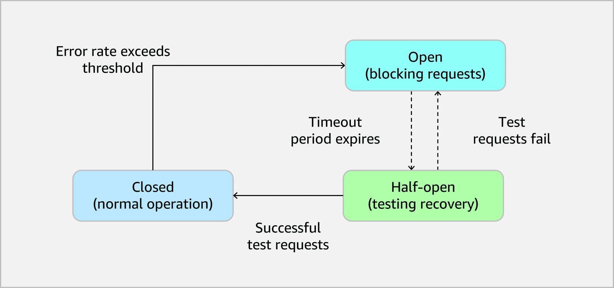

## Circuit Breaker Patterns for AI Workloads 🛑⚡

Circuit breakers protect your AI workflows from cascading failures when downstream services (like foundation models) misbehave or are unavailable.

---

## 1. Purpose of circuit breakers in AI workflows 🎯

Circuit breaker patterns are used to:

- **Isolate failures** – stop a bad AI service from impacting the whole system.
- **Protect resources** – avoid repeatedly calling something that is likely to fail.
- **Recover automatically** – resume normal traffic when services recover.
- **Gracefully degrade** – keep core functionality working, even if “fancy” AI fails.

> Exam idea: Circuit breakers turn repeated failures into controlled, observable states instead of system-wide outages.

---

## 2. Core circuit breaker states 🔁

Circuit breakers usually have **three states**:

- **Closed (normal)**  
  - All requests flow to the service.  
  - Errors are monitored.

- **Open (blocking)**  
  - Error rate exceeded threshold → circuit opens.  
  - Requests are blocked or sent to fallback paths.  
  - Protects system from repeated failures.

- **Half-open (testing)**  
  - After a timeout, send limited **test requests**.  
  - If they succeed → go back to **Closed**.  
  - If they fail → revert to **Open** and wait longer.

---

## 3. Using AWS Step Functions for circuit breakers 🧩

AWS Step Functions provides a **state machine model** that fits circuit breaker logic well.

### 3.1 State machine design
Define states for:

- Normal operation
- Error detection
- Circuit open
- Recovery testing (half-open)

### 3.2 Error detection & thresholds
- Track **error counts, error rates, response times**.
- Define thresholds (absolute counts and/or percentages) that trigger **Open**.
- Use **sliding windows** to evaluate recent failures and avoid reacting to tiny sample sizes.

### 3.3 Timeout & recovery logic
- Set **timeouts** for model calls.  
- Use **exponential backoff** for repeated failures.  
- Half-open logic sends a few test calls to see if the service has recovered.

### 3.4 State persistence
Store circuit state and metrics outside the state machine, e.g. in:

- **Amazon DynamoDB** (circuit state, error counts, timestamps).

This ensures state is preserved across executions and restarts.

---

## 4. Implementing fallback paths 🪂

To keep services running when the primary AI model is down or degraded, you need **fallback strategies**:

### 4.1 Alternate model routing
- If primary model fails:
  - Route to alternative models (e.g., another Bedrock model or another region).
  - Ensure fallback models meet minimum quality requirements.

### 4.2 Degraded functionality
- When advanced AI is unavailable, use simpler logic such as:
  - Cached responses
  - Rule-based systems
  - Basic processing or shorter summaries
- Clearly communicate reduced capability to users.

### 4.3 Cross-region failover
- Use geographic redundancy:
  - Route requests to models in other AWS Regions if regional services fail.
  - Use Bedrock Cross-Region Inference where applicable.
- Choose regions considering latency, cost, and model availability.

---

## 5. Monitoring & optimizing circuit breakers 📈

Amazon CloudWatch is central to observing circuit breaker behavior.

Track at least:

- **Circuit state transitions**  
  - When circuits go Closed → Open → Half-open.
- **Error rates and types**  
  - Timeouts, 4xx vs 5xx, provider-specific errors, etc.
- **Response times**  
  - Detect performance degradation before total failure.
- **Fallback usage**  
  - How often fallback paths are triggered and how well they perform.

Best practices:

- Create **CloudWatch alarms**:
  - On open circuits
  - On abnormal error rates or latency spikes
- Use custom metrics for **business-level impacts**:
  - User experience, service quality, success rates.
- Build **dashboards and trend analysis**:
  - See patterns over time and tune thresholds and timeouts accordingly.

---

## 6. Best practices for AI circuit breakers (exam-friendly) ✅

- Always design **graceful degradation**:
  - Core business functions must still work even if AI is partially down.
- Use **alternate models and simple logic** as safety nets.
- Combine **circuit breakers + fallback models + cross-region failover** for strong resilience.
- Persist state (e.g., in DynamoDB) to keep accurate error counts and timers.
- Tune thresholds carefully:
  - Avoid too sensitive (opens on tiny blips).
  - Avoid too lax (doesn’t open until it’s too late).

