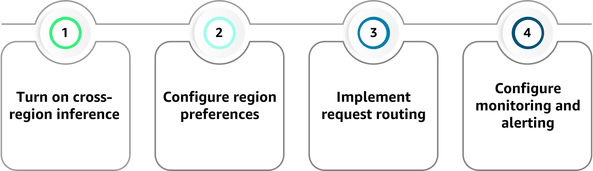

## Amazon Bedrock Cross-Region Inference 🌐

Amazon Bedrock Cross-Region Inference lets you call foundation models in **other AWS Regions transparently**:

- You keep using the **same Bedrock API**.
- Bedrock can route requests to another region if:
  - The model isn’t available in your primary region, or
  - The primary region is experiencing disruption.

**Key benefits:**
- **Model availability** – Access models not present in your local region.
- **Resilience** – Automatic failover to secondary regions during outages.
- **Simplified architecture** – Single API interface; cross-region routing handled by Bedrock.
- **Consistent interface** – Same request/response format regardless of region.

---

## 2. Regional model availability – design considerations 🧭

When designing multi-region AI:

### Model distribution patterns
- Not all models are available in all regions.
- Availability changes over time → you must check documentation regularly.

### Regional capacity
- Some regions have more capacity than others.
- High-demand regions can have throttling or higher latency → consider capacity when choosing **primary vs secondary** regions.

### Compliance & data residency
- Some workloads must stay within specific regions due to regulations.
- Cross-region routing must respect compliance and data residency policies.

### Model version consistency
- Different regions may host different versions of the same model.
- Cross-region inference tries to use equivalent versions, but behaviors may differ.
- Monitor versions & be aware of potential response differences.

---

## 3. Setting up Cross-Region Inference – high-level steps 🛠️

### 3.1 Turn on cross-region inference
- Enable cross-region inference in Bedrock.
- Confirm it’s supported for the models you plan to use.

### 3.2 Configure region preferences
- Define primary and secondary regions based on:
  - Latency
  - Compliance
  - Business requirements
- Prefer local region for performance, but specify fallbacks.

### 3.3 Implement request routing
- Your app continues using standard Bedrock API calls.
- Bedrock automatically handles cross-region routing during:
  - Regional failures
  - Capacity issues

### 3.4 Configure monitoring & alerting
- Use CloudWatch to:
  - Track which region is serving requests.
  - Monitor latency and error rates per region.
- Alert when:
  - Failover is happening frequently.
  - Secondary regions are serving most traffic.

---

## 4. Multi-region architecture patterns 🏛️

### 4.1 Active–Passive failover
- Primary region handles all traffic in normal operation.
- Secondary region(s) used only when:
  - Primary region is degraded or down.
- Simpler pattern, good for:
  - Critical workloads that need backup, but don’t require global load balancing.

### 4.2 Active–Active distribution
- Multiple regions serve traffic simultaneously.
- Requests distributed via:
  - Geographic routing (closest region)
  - Weighted routing (traffic split by percentage)
- Benefits:
  - Better capacity utilization
  - Lower global latency
  - Higher resilience
- Tradeoff: more complex to coordinate and observe.

### 4.3 Hybrid approaches
- Mix active–passive and active–active:
  - Some models use active–active (global traffic).
  - Others use active–passive (backup only).
- Choose pattern per model or workload based on:
  - Availability needs
  - Latency sensitivity
  - Cost

---

## 5. Performance & cost considerations 📈💰

### Performance
- Cross-region calls introduce extra **network latency**.
- Optimize by:
  - Choosing failover regions close to users or your app.
  - Optionally using edge locations/CDNs to reduce user-perceived delay.
- Monitor:
  - Latency per region
  - Impact on user experience during failover

### Cost optimization
- **Region selection:**
  - Pick cost-effective regions as secondary while still meeting latency/compliance needs.
- **Request optimization:**
  - Reduce cross-region calls with caching (e.g., responses for repeated queries).
  - Use batching where appropriate.
- **Monitoring usage:**
  - Track how often cross-region inference is used.
  - Identify patterns and tune architecture or thresholds.
- **Capacity planning:**
  - Right-size capacity in primary region to minimize unnecessary failovers.
  - Plan capacity in secondary regions for peak failover loads.

---

## 6. Implementation best practices ✅

### Testing strategy
- Regularly test failover via:
  - Planned drills
  - Chaos engineering scenarios
- Verify:
  - Latency behavior
  - Model version/behavior differences
  - Correct routing to fallback regions

### Monitoring setup
- Aim for comprehensive observability:
  - Region-wise latency and error rates
  - Volume of cross-region traffic
  - Cost impact
- Set alerts for:
  - Unusual cross-region activity
  - Persistent use of secondary regions
  - Performance regressions

### Documentation & runbooks
- Document:
  - Preferred and secondary regions
  - Failover procedures and policies
  - Baseline performance expectations by region
- Maintain **runbooks** so ops teams know how to respond during incidents.

