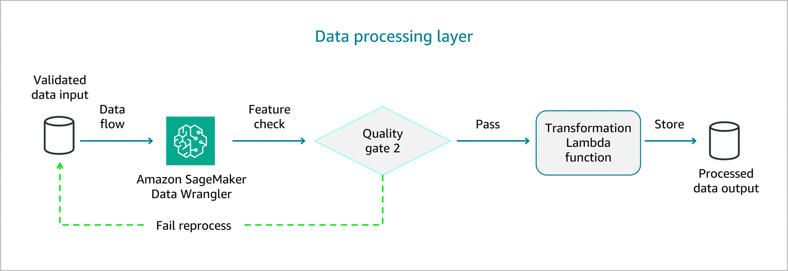
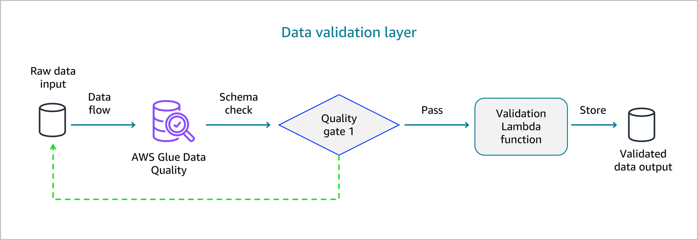
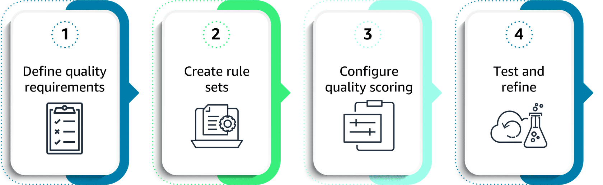
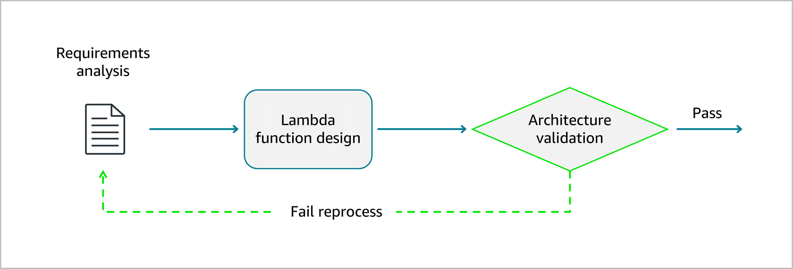

## Advanced Data Processing & Validation with AWS Services 🚀

Data validation is a **first-class citizen** for foundation model workflows. This summary focuses on how Lambda, AWS Glue Data Quality, and SageMaker Data Wrangler work together to keep data clean, consistent, and trustworthy for FMs.

---

## 1. Why advanced validation matters for FMs 🎯

High‑quality data is mandatory for:
- Accurate, reliable model behavior
- Reduced hallucinations and bias
- Stable user experience in production

Advanced validation across AWS services lets you:
- Implement **integrated validation workflows**.
- Develop **custom checks** for FM‑specific needs (prompts, RAG docs, fine‑tuning data).
- Configure **real-time validation** for streams.
- Design **quality scoring & thresholds** for automated accept/reject decisions.

---

## 2. Lambda for real‑time and custom validation ⚡

Lambda excels at:
- Complex validation logic beyond basic rules.
- Integrating external services/APIs during validation.
- Real‑time checks on streaming or event-driven data.

When you design Lambda-based validation:
- Size functions correctly (timeout, memory, concurrency).
- Optimize cold‑start and execution time.
- Implement strong error handling and retries so the **pipeline never silently drops data**.

> Think of Lambda as the **custom validation brain** in your FM pipeline.

---

## 3. AWS Glue Data Quality (DQDL) – enterprise‑scale rules 🧱

Glue Data Quality provides a **rule-based framework (DQDL)** for large-scale validation of both structured and unstructured data.

Validation layers often look like this:





### What DQDL gives you
- Declarative rules for:
  - Completeness, ranges, patterns, allowed values.
  - Schema conformance and constraints.
- Reusable rule sets across tables/streams.
- Automated quality gates (fail fast before bad data reaches FMs).

**Example – text data validation for FM content**



```dqdl
Rules = [
  ColumnLength "content" between 100 and 10000,
  ColumnValues "content" matches "[\\p{L}\\p{N}\\p{P}\\p{Z}]+",
  IsComplete "content",
  CustomSql "SELECT COUNT(*) FROM primary WHERE content LIKE '%[ERROR]%'" = 0
]
```

Use DQDL for:
- Text content checks (length, encoding, allowed chars).
- Structured metadata validation (IDs, timestamps, enums).
- Custom SQL-based rules for domain-specific constraints.

---

## 4. SageMaker Data Wrangler – interactive & statistical validation 📈

When you need to **explore and refine data** before it hits your FM pipeline, Data Wrangler is the interactive companion to Glue + Lambda.



Key capabilities:
- **Data profiling** for training datasets:
  - Distributions, missing values, duplicates, outliers.
  - FM-centric insights like document length, vocab diversity, topic coverage.
- **Statistical validation for distribution shift:**
  - Compare new data vs baseline; trigger alerts when distributions move.
- **Custom transformations:**
  - Text normalization, content filtering, format standardization.
  - Save transformations as reusable steps in automated pipelines.
- **Content structure analysis** for unstructured text:
  - Understand sections, headings, density → better FM preprocessing.

Use sampling for massive datasets to keep workflows interactive but still representative.

---

## 5. Integration & monitoring across services 🔗

Glue, Lambda, and Data Wrangler are most powerful when **orchestrated together** and monitored via CloudWatch.

Integration pattern:
- Glue Data Quality → first quality gate (schema & rules).
- Lambda → custom, real‑time, FM‑specific validation.
- Data Wrangler → interactive profiling and transformation design.

Monitoring pattern:
- Publish custom metrics (e.g., `ValidationSuccessRate`, `ProcessedRecords`) to **CloudWatch**.
- Set alarms on:
  - Low success rates
  - High latency or error spikes
  - Distribution shifts detected in Data Wrangler

This gives you **end‑to‑end visibility** into the health of your data pipeline feeding foundation models.

---

## 6. Exam‑friendly takeaways ✅

- Lambda → **real-time, custom validation brain** for FM pipelines.
- Glue Data Quality (DQDL) → **enterprise‑scale, rule-driven quality gates**.
- SageMaker Data Wrangler → **interactive profiling, shift detection, and transformations**.
- Together + CloudWatch → a **robust, observable data quality layer** that keeps FM workloads reliable and compliant.


