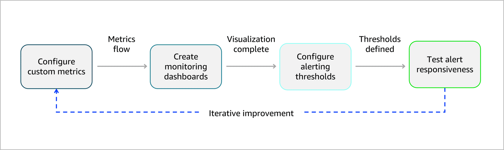
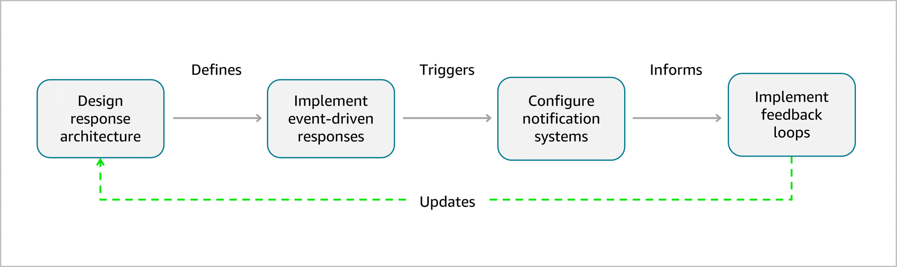
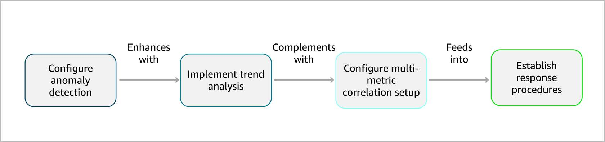

## Integrated Monitoring and Remediation for FM Pipelines 🚨📈

Effective monitoring + automated remediation = the **backbone of reliable foundation model pipelines**. This note compresses the lesson into exam‑oriented bullets.

---

## 1. Why integrated monitoring matters 🎯

Without monitoring, data quality degradation is often invisible until **model outputs are clearly wrong**. With integrated monitoring you can:

- Detect data quality issues early.
- Respond automatically (remediation workflows).
- Maintain consistent FM performance and user trust.

Key goals:
- Configure **CloudWatch** to track data quality and performance.
- Design **automated remediation workflows** (Step Functions + Lambda).
- Implement **alerting** for proactive detection.
- Build **dashboards** for pipeline health visibility.

---

## 2. Amazon CloudWatch metrics for data quality tracking 📊

CloudWatch is the central hub to monitor metrics from:
- AWS Glue
- Amazon SageMaker
- AWS Lambda
- Other validation and processing services

### 2.1 Foundation model data quality metrics
Examples:
- `ValidationSuccessRate = (PassedValidations / TotalValidations) * 100`
- `ContentLengthMean`, `ContentLengthStdDev`
- `LanguageDetectionAccuracy`
- `SafetyScoreDistribution`

These indicate **data pipeline health** before problems show up in FM outputs.

### 2.2 Monitoring setup cycle

Monitoring follows a four‑step cycle:
1. **Configure custom metrics** – data quality + performance indicators.
2. **Create dashboards** – visualize trends and health.
3. **Configure alert thresholds** – alarms for degradation.
4. **Test alert responsiveness** – verify detection + notifications.

Example metrics publisher (conceptual):
- Publishes:
  - `ValidationSuccessRate`
  - `AverageContentLength`
  - `ProcessingLatency`
- Uses a dedicated namespace like `DataValidation/FoundationModels`.

---

## 3. Automated remediation workflows 🛠️

With **Step Functions + Lambda**, you can automatically fix issues instead of paging humans for every error.

Common remediation patterns:

- **Automatic data reprocessing**
  - Retry transient failures with exponential backoff.
  - Re-run validations with adjusted parameters when appropriate.

- **Content filtering and correction**
  - Remove/normalize encoding issues, bad formats, or unsafe content.
  - Standardize formats and text encoding across the dataset.

- **Dynamic threshold adjustment**
  - Adapt validation thresholds based on historical performance & natural variation.
  - Balance strict quality with processing efficiency.

- **Escalation & human‑in‑the‑loop**
  - Escalate complex or ambiguous cases to human reviewers.
  - Feed human decisions back to improve automated rules.

Design pattern:
- Step Functions **choice states** route records to specialized Lambda remediators.
- Failed validations go through a **feedback loop**; only cleaned data proceeds.

---

## 4. Proactive issue detection & advanced techniques 🔍

Proactive detection combines:
- **Anomaly detection** on key metrics.
- **Trend analysis** for slow drifts.
- **Multi‑metric correlation** to detect systemic issues.

High‑level flow:
1. Configure CloudWatch anomaly detection for data quality metrics.
2. Analyze trends over time (e.g., success rate drift, length shift).
3. Correlate multiple metrics to identify complex failures.
4. Trigger response procedures (automated remediation + escalation).

Advanced techniques:
- Statistical process control.
- ML‑based anomaly detection.
- Composite health indicators (single “health score” per pipeline).

> Exam hook: **Composite health indicators** let you quickly assess overall pipeline health without inspecting dozens of individual metrics.

---

## 5. Integration with remediation systems 🔗

Effective systems connect **monitoring → events → remediation**:

- **CloudWatch** – metrics, alarms, anomaly detection.
- **Amazon SNS** – notifications to humans/systems.
- **AWS Step Functions** – orchestrates remediation workflows.
- **AWS Lambda** – executes concrete remediation actions.

Design pattern (continuous improvement loop):
1. **Design response architecture** – map issue types → remediation strategies.
2. **Implement event‑driven responses** – alarms/events trigger Step Functions.
3. **Configure notification systems** – SNS, email, chat, ticketing.
4. **Implement feedback loops** – refine thresholds and workflows based on effectiveness.

Exam‑style answers:
- **Primary advantage of composite health indicators:** quick assessment of overall system health.
- **Key services for event‑driven remediation:** **AWS Step Functions + AWS Lambda**.
- **Most important factor in feedback loops:** measuring the **effectiveness of automated responses**, then iterating.

