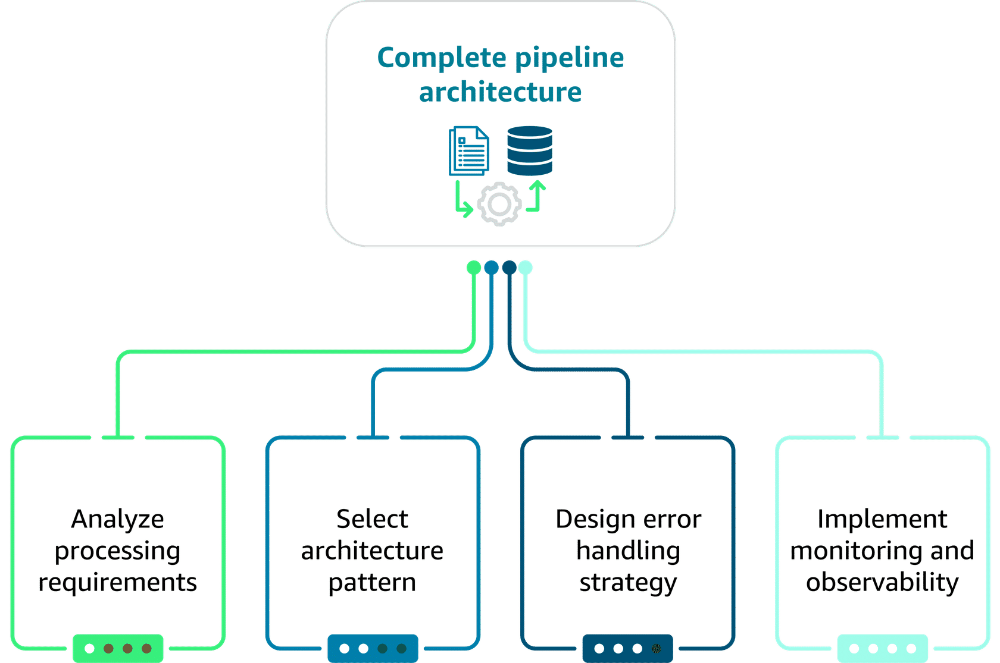
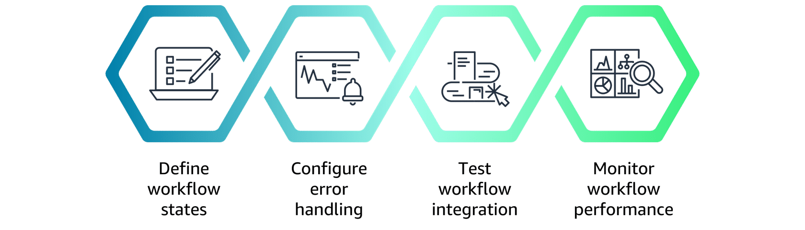

## End-to-End Workflow Integration for FM Data Pipelines 🔗


End-to-end workflow integration connects all your **validation, monitoring, and remediation** stages into a single, auditable pipeline.

---

## 1. Why end-to-end integration matters 🎯

Goals:
- Connect validation stages into a **complete, automated pipeline**.
- Design architectures that **scale with data volume and complexity**.
- Orchestrate multiple AWS services (Glue, Lambda, SageMaker, Step Functions, SNS, CloudWatch).
- Configure **quality gates and conditional processing** for reliable data flow.

Benefits:
- Consistent data quality across all stages.
- Full traceability and auditability.
- Easier debugging and continuous improvement.

---

## 2. Pipeline architecture patterns 🏗️



Three core patterns:

- **Sequential processing pattern**
  - Each validation step runs in order; next depends on previous.
  - Best when validations have **strong dependencies**.
  - Exam hook: choose sequential when the order **must** be preserved.

- **Parallel processing pattern**
  - Independent validations run concurrently.
  - Improves throughput when checks don’t depend on each other.
  - Exam hook: most important requirement → steps must be **independent**.

- **Hybrid processing pattern**
  - Mix of sequential + parallel:
    - Critical dependencies in sequence.
    - Independent checks in parallel.
  - Example:  
    `Input → Schema Validation → [Content Quality | Safety Check] → Final Validation → Output`

> Best practice: Use **hybrid** to balance speed with dependencies and error-handling needs.

---

## 3. Orchestration with AWS Step Functions 🧩

Step Functions orchestrate multi-stage validation pipelines with:
- Visual workflows & state management.
- Native integration with Glue, Lambda, SageMaker, SNS, etc.
- Built-in retries, error handling, and audit trails.


### 3.1 Workflow state management
- Tracks:
  - Input data
  - Intermediate outputs
  - Errors and metadata
- Enables replay, debugging, and full execution history.

### 3.2 Service integration patterns
- **Synchronous** – quick operations.
- **Asynchronous** – long-running tasks.
- **Callback** – external systems signal completion.

### 3.3 Error handling and retry logic
- Use:
  - Retry policies with backoff for transient errors.
  - Catch blocks for specific error types.
  - Fallback states when automatic recovery isn’t possible.



### 3.4 Conditional processing & quality gates
- Use **Choice** states for:
  - Threshold-based gates.
  - Adaptive gates (dynamic thresholds).
  - Multi-criteria gates (content, safety, completeness).

Example multi-criteria gate (conceptual):
```python
if all(score >= 0.7 for score in scores.values()):
    return "standard_processing" if scores["content_quality"] < 0.9 else "premium_processing"
else:
    return "remediation_required"
```

---

## 4. Feedback loops & continuous improvement 🔁

Feedback loops keep pipelines **self-optimizing**:

1. **Define feedback metrics**
   - Validation accuracy, latency, throughput, cost per record, downstream model performance.
2. **Implement data collection**
   - Emit metrics/events from each stage without hurting performance.
3. **Analyze performance trends**
   - Identify bottlenecks, brittle rules, and data drifts.
4. **Automate parameter adjustment**
   - Tune thresholds, routing rules, and resource allocation based on feedback.

Types of feedback:
- **Performance optimization** – latency, throughput, cost.
- **Quality effectiveness** – which rules/gates actually improve FM behavior.
- **Operational reliability** – error patterns, retries, manual interventions.

Exam hook: The most important factor in feedback loops is **measuring the effectiveness of automated responses** and using that to refine the system.

---

## 5. Real-world implementation example – logistics pipeline 🚚

Business context:
- Global logistics company processing shipment data (coordinates, addresses, dimensions, timeframes) for a route-optimization FM.
- Needs **thousands of shipments/hour** validated with strict quality and full audit trails.

Architecture (simplified):
- **Glue Data Quality** – schema + rules for structured shipment data.
- **Lambda validators** – geospatial checks, business rules.
- **Step Functions** – orchestrate ingestion, validation, quality gates, and routing.
- **CloudWatch** – monitors validation success, latency, quality scores and triggers alerts/remediation.

Multi-layer quality gates:
- Coordinate accuracy, address validation, timeframe feasibility.
- Overall quality score used in a Choice state:
  - `>= 90` → publish to FM.
  - `>= 75` → enhanced validation.
  - Else → reject/remediation.

Result:
- End-to-end, auditable FM data pipeline with:
  - Clear architecture patterns.
  - Strong orchestration and error handling.
  - Continuous feedback and optimization.


