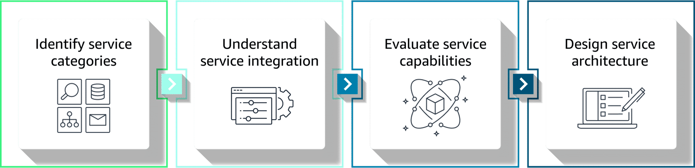

## Multimodal Data Processing & Pipelines for FMs 🎥📝🔊

Multimodal processing = using **multiple content types** (text, images, audio, video) together so foundation models see richer context, similar to how humans combine senses.

This note distills the lesson into exam‑ready concepts: data types, characteristics, AWS services, and patterns.

---

## 1. Multimodal data types & characteristics 🧱

**Key multimodal types:**
- **Image–text pairs** – product photos + descriptions, docs with diagrams.
- **Audio–video content** – recorded talks, training videos, support calls.
- **Synchronized inputs** – video + captions, audio + transcripts, slides + narration.

**Relationship patterns:**
- **Complementary** – each modality adds different info (image + spec sheet).
- **Redundant** – modalities carry similar info (video + accurate captions).

Quality considerations:
- Image resolution/clarity.
- Audio quality and noise levels.
- Text accuracy/completeness.
- Temporal synchronization across modalities.

Processing complexity grows as modalities and relationships increase → impacts **compute, latency, and pipeline design**.

---

## 2. AWS services for multimodal processing 🧩

Think in 4 categories:

- **Content analysis services**
  - Amazon Bedrock multimodal models – joint text+image understanding, captioning, VQA, cross‑modal reasoning.
  - Amazon Transcribe – speech → text for audio/video.

- **Processing/orchestration**
  - Amazon SageMaker Processing – custom multimodal feature extraction and preparation at scale.
  - AWS Step Functions + Lambda – orchestrate flows, conditional branches, and error handling.

- **Storage & data management**
  - Amazon S3, Glue, and friends – store raw/processed assets, maintain schemas and catalogs.

- **Foundation models**
  - Bedrock multimodal FMs as the inference/training target.

Systematic service selection flow:
1. **Identify service categories.**
2. **Understand integrations** (data flow, triggers, events).
3. **Evaluate capabilities** (formats, speed, output quality).
4. **Design architecture** that meets latency, throughput, and quality needs.

---

## 3. Processing workflow patterns 🔀

Multimodal pipelines reuse the same patterns you saw for validation:

- **Sequential workflows**
  - One step feeds the next (e.g., Transcribe audio → analyze text → combine with metadata).
  - Good for strong dependencies; easier debugging.

- **Parallel workflows**
  - Process modalities independently, then merge (CV on images + NLP on text in parallel).
  - Best when steps are **independent** and you need speed.

- **Hybrid workflows**
  - Critical stages in sequence; independent analyses in parallel.
  - Flexible choice for complex pipelines with mixed dependencies.

> Exam hook: multimodal often combines **parallel per‑modality processing** with **sequential fusion** and quality gates before sending to FMs.

---

## 4. Common multimodal use cases 💡

- **Product classification & catalog management**
  - Images + text → richer product understanding; better categorization.

- **Content moderation & safety**
  - Text for language; images/video for visuals; audio for harmful speech → combined decision.

- **Accessibility & inclusive design**
  - Captions, transcripts, audio descriptions → alternate formats for different abilities.

- **Educational content processing**
  - Combine text, diagrams, video, audio → multi‑style learning materials and summaries.

These highlight where multimodal gives **clear business value** over text‑only or image‑only systems.

---

## 5. Systematic framework for multimodal AI solutions ✅

Steps to design robust multimodal pipelines:

1. **Analyze data types and relationships.**
2. **Define processing requirements** (latency, accuracy, cost, compliance).
3. **Select AWS services** for each modality and orchestration.
4. **Choose workflow pattern** (sequential, parallel, hybrid).
5. **Add validation, monitoring, and feedback loops** (CloudWatch, metrics, alarms).

Key exam takeaway: treat multimodal pipelines as **composed, well‑orchestrated workflows**—not just “send everything to a big model”—with clear service roles, quality checks, and architecture patterns.

