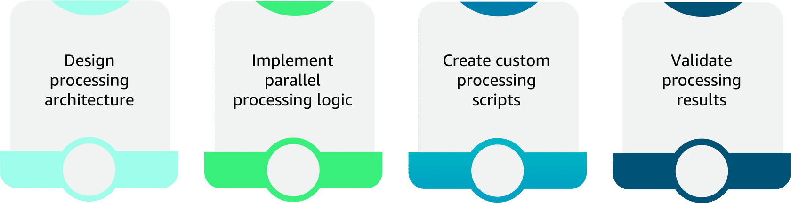
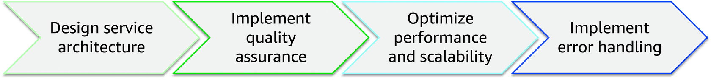

## Advanced Multimodal Processing Techniques 🎛️

Advanced multimodal processing builds on the basics to create **specialized, high‑performance workflows** that coordinate Bedrock multimodal models, SageMaker Processing, and Amazon Transcribe.

---

## 1. Bedrock multimodal integration 🧠🖼️

Key goals:
- Match **data types** (image+text, documents, video frames) to the right Bedrock model.
- Format inputs correctly for each model family.
- Manage context windows for long or rich content.

### 1.1 Model selection for multimodal tasks
- Some models excel at **image–text reasoning** (captioning, VQA).
- Others specialize in **document understanding** or **visual search**.
- Evaluate by:
  - Supported input types.
  - Context window size.
  - Latency/perf characteristics.
  - Output quality for your use cases.

### 1.2 Input formatting & context management
- Resize/normalize images to recommended resolution.
- Structure text clearly (sections, delimiters, metadata).
- For large content:
  - Chunk inputs while preserving multimodal relationships.
  - Use overlap to maintain continuity.
  - Reconstruct outputs into coherent results.

### 1.3 Prompt engineering for multimodal
- Specify how text and images relate (“answer based on BOTH the image and the text”).
- Define output format (JSON, bullet list, reasoning + answer).
- Use few‑shot examples with combined image/text descriptions.

---

## 2. SageMaker Processing for custom multimodal workflows ⚙️

Use **SageMaker Processing** when you need:
- Cross‑modal alignment (time, space, semantics).
- Heavy feature extraction and transformation.
- Parallelized, container‑based workloads.

### 2.1 Cross‑modal alignment
- Keep relationships intact:
  - Temporal (audio ↔ video frames).
  - Spatial (image regions ↔ text spans).
  - Semantic (concepts aligned across modalities).
- Strategies:
  - Define alignment parameters and validation checks.
  - Use ML/statistical methods to detect and correct drift.

### 2.2 Parallel & custom processing
- Distribute work across instances:
  - Split by files, time windows, or modality.
  - Aggregate results into unified multimodal features.
- Implement custom scripts for:
  - Domain‑specific transforms.
  - Feature extraction not covered by managed services.
  - Model‑specific data prep (formats, embeddings, metadata).

---

## 3. Audio‑visual workflows with Amazon Transcribe 🎙️🎬

Transcribe is the **audio leg** of multimodal pipelines:
- Converts speech → text for further NLP/Bedrock processing.
- Supports multiple languages, custom vocabulary, and **speaker diarization**.

Key techniques:
- **Audio extraction & quality control** from video.
- Configure transcription parameters:
  - Language, channel type, vocabulary, diarization.
- **Timestamp synchronization**:
  - Align transcripts with video frames/cues.
  - Handle drift corrections and alignment validation.

Bedrock + Transcribe + SageMaker:
- Transcribe generates accurate, time‑aligned text.
- SageMaker/Bedrock consume that text alongside visual features.
- Combined analysis powers search, summarization, moderation, and analytics.

---

## 4. Advanced patterns: orchestration, QA, and scalability 📈

Use the same advanced patterns as other FM pipelines, applied to multimodal:

- **Service orchestration** (Step Functions + Lambda)
  - Sequential, parallel, and hybrid workflows per modality and task.
  - State tracking, retries, and error routing.

- **Quality assurance integration**
  - Quality gates at key checkpoints (image quality, transcription confidence, alignment scores).
  - Feedback loops that tune thresholds and preprocessing over time.

- **Scalability & performance optimization**
  - Auto scaling, caching, and batching tuned per modality.
  - Predictive scaling for known spikes (events, campaigns).

Taken together, these techniques let you design **robust, scalable multimodal pipelines** that fully exploit Bedrock multimodal models while keeping costs, latency, and quality under control.

