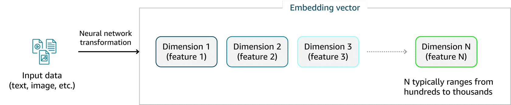
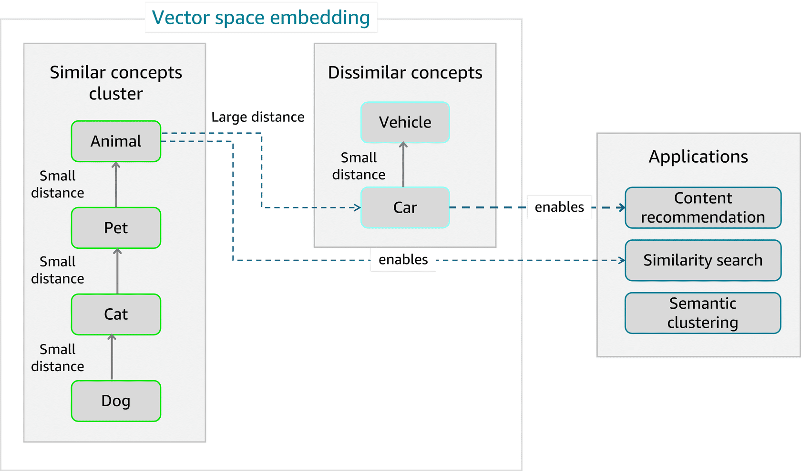

## Vector Embeddings & Retrieval for Foundation Models 📐🔎

Vector databases and embeddings change how we store and retrieve knowledge for generative AI. Instead of exact string matches, we query **semantic meaning** in high‑dimensional space.

---

## 1. What are vector embeddings? 🧠

Vector embeddings are **numerical vectors** that capture the semantic meaning of text, images, or other data types. Specialized neural networks turn content into **fixed‑length vectors** that models can compare and reason over.

Key points:
- Each embedding has **hundreds or thousands of dimensions**.
- Similar concepts → vectors close together; unrelated concepts → far apart.
- Phrases like “customer support” and “help desk” end up near each other in vector space.

This enables:
- Semantic search
- Recommendation systems
- Retrieval‑augmented generation (RAG)

---

## 2. Distance metrics & similarity search 📏

Vector databases use **distance/similarity metrics** to find nearest neighbors.

Common metrics:
- **Cosine similarity**
  - Measures the angle between two vectors (direction only).
  - Great for text embeddings where document length shouldn’t dominate.

- **Euclidean distance**
  - Straight‑line distance; uses both direction and magnitude.
  - Works when absolute embedding values carry meaning, but can be sensitive in very high dimensions.

- **Dot product**
  - Multiplies and sums corresponding elements.
  - Considers both angle and magnitude; efficient, but may favor longer vectors.

Choose metrics based on:
- Data type (text vs images).
- Whether magnitude should matter.
- Performance characteristics of your vector DB.

---

## 3. Vector DB vs traditional DB 🆚

### Storage & indexing
- **Traditional DBs**
  - Tables, rows, columns; optimized for relational queries and exact lookups.
- **Vector DBs**
  - Store high‑dimensional arrays + metadata.
  - Use ANN indexes (e.g., HNSW, IVF) for fast similarity search (approximate nearest neighbor).

### Query logic
- Traditional: SQL, filters, exact matches, joins.
- Vector: “find top‑k nearest neighbors to this embedding,” often combined with metadata filters.

### Performance & use cases
- Traditional:
  - Best for OLTP, reporting, exact data retrieval.
- Vector:
  - Best for **semantic search, recommendations, RAG, content discovery**, and any task requiring similarity matching.

> Exam hook: vector DBs trade some precision for speed using approximate search, but unlock semantic retrieval that keyword search can’t provide.

---

## 4. Foundation model augmentation with RAG 📚

**Retrieval‑Augmented Generation (RAG)** augments a pre‑trained FM with external knowledge from a vector store **at inference time**:

1. Convert documents into embeddings and store them in a vector DB.
2. At query time, embed the user question using the **same embedding model**.
3. Retrieve top‑k relevant chunks via similarity search.
4. Feed retrieved context into the FM as part of the prompt.

Benefits:
- Update knowledge without retraining the base model.
- Reduce hallucinations by grounding answers in retrieved facts.
- Provide citations and traceability.

Implementation considerations:
- Embedding model consistency between ingestion and retrieval.
- Chunk size and overlap tuned to model context window.
- Similarity threshold tuning for precision vs recall.
- Rich metadata for filtering, ranking, and attribution.

---

## 5. AWS vector store options 🧰

AWS services for vector search and RAG:

- **Amazon Bedrock Knowledge Bases**
  - Fully managed RAG/KB integration for Bedrock models.
  - Handles ingestion, chunking, embedding generation, and vector storage.

- **Amazon OpenSearch Service (Neural search)**
  - Hybrid keyword + vector search in one engine.
  - Great when you need both classic search and semantic search.

- **Amazon S3 Vector Stores**
  - Vector search directly on S3 objects with serverless semantics.
  - Scales to billions of vectors with minimal infra management.

- **Amazon RDS with pgvector**
  - Combine relational data + embeddings in PostgreSQL.

- **Partner vector DBs (e.g., Pinecone)**
  - Specialized features: distributed indexes, real‑time updates, custom metrics.

Choose based on:
- Required scale and latency.
- Need for hybrid search.
- Operational model (fully managed vs custom).

