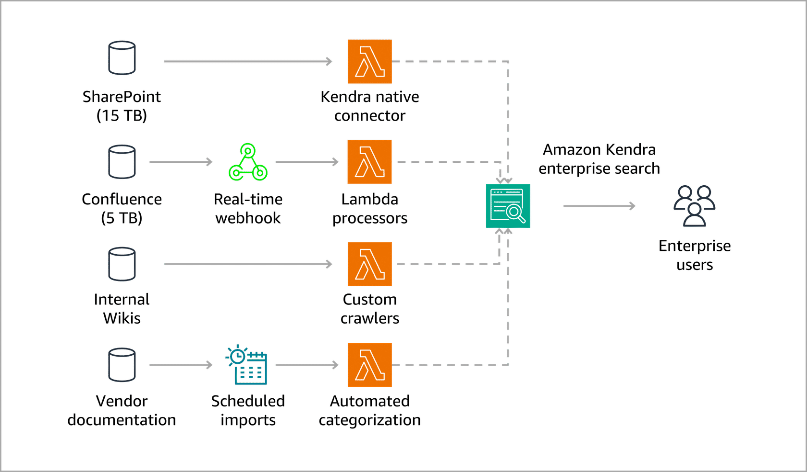
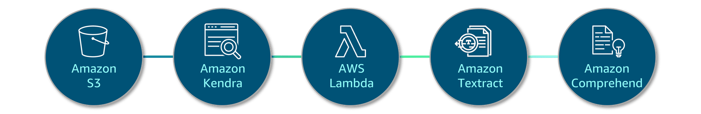
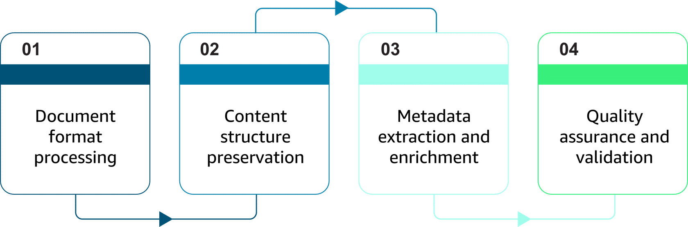
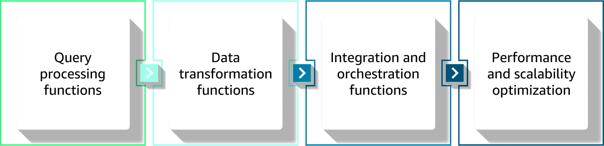
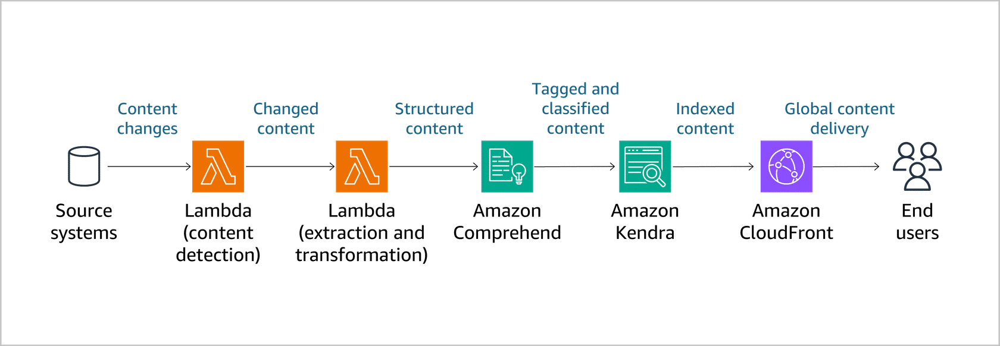
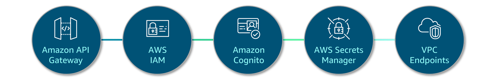
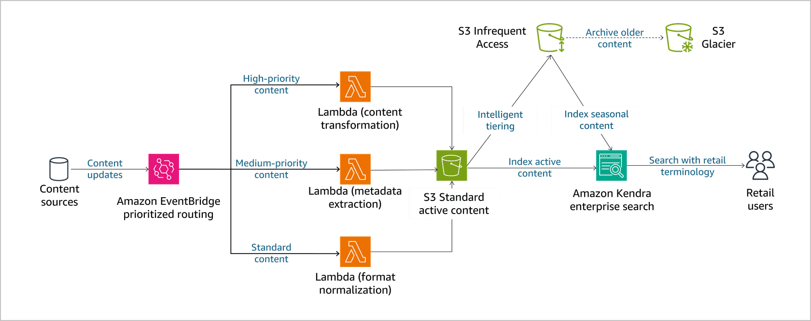
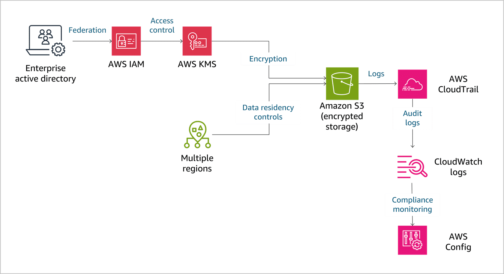

## Enterprise Content Integration for Generative AI 🧠📂

Enterprise content integration = turning **static documents + wikis + KBs** into a **searchable, AI-ready knowledge fabric**. This note focuses on using AWS services to extract, transform, and load content into GenAI pipelines.

---

## 1. Core goal & building blocks 🧱

- **Goal**: Connect DMS, wikis, KBs, and external sources into a **unified content layer** for RAG and GenAI assistants.
- **Key AWS services**
  - **Amazon S3** – canonical storage, versioning, lifecycle, replication.
  - **Amazon Kendra** – semantic, relevance-tuned enterprise search.
  - **AWS Lambda** – serverless glue for ETL, enrichment, and routing.
  - **Amazon Textract** – OCR + structure from PDFs/scans.
  - **Amazon Comprehend** – entities, classification, PII, language.
  - **Amazon API Gateway + EventBridge + Step Functions** – secure APIs, events, and orchestration.

Think: **S3 + Kendra + Lambda/Textract/Comprehend + integration fabric (API GW/EventBridge/Step Functions).**

---

## 2. Document management system (DMS) → AI pipeline 📄➡️🤖

### Storage & search architecture

- **S3 for storage**
  - Structured paths: e.g. `{env}/{dept}/{doc-type}/{yyyy/mm/dd}/`.
  - **Lifecycle rules** + **Intelligent-Tiering** to manage cost over time.
  - Cross-region replication for DR and locality.
  - Strong bucket policies for **least privilege** and classification.

- **Kendra for indexing & search**
  - Map fields like `department`, `doc_type`, `classification`, `last_reviewed`.
  - Use relevance tuning + click feedback.
  - Enable **incremental indexing** for ongoing updates.

- **Metadata & tagging**
  - Standard schema (doc type, dept, sensitivity, last-reviewed).
  - Lambda to auto-tag from file path + content.
  - Keep metadata aligned with **vector store filters** and guardrails.

### Platform connectors (SharePoint, Box, legacy) 🔌

- **SharePoint**
  - Native Kendra connector; preserves ACLs and metadata.
  - Uses change logs for incremental crawl.
- **Box**
  - OAuth 2.0, webhooks for real-time updates.
  - Maps Box metadata → Kendra/custom fields.
- **Custom / legacy**
  - API Gateway webhooks + Lambda + Step Functions.
  - Handles proprietary schemas and databases.

> Exam theme: **Use managed Kendra connectors where possible; use Lambda+API GW/EventBridge for everything else.**

---

## 3. Knowledge base & wiki integration 📚🌐

### Secure API connectivity

- **API Gateway** – secure, throttled APIs for KBs/wikis.
- **IAM** – service-to-service permissions (least privilege).
- **Amazon Cognito** – user authN/Z (MFA, SSO, groups).
- **Secrets Manager** – manage API keys / DB creds.
- **VPC endpoints** – keep traffic private (no public internet).

### API Gateway security patterns

- **AuthN/AuthZ**
  - API keys for service calls.
  - OAuth 2.0 / JWT validation for users.
  - Custom authorizers + IAM roles for RBAC.
- **Rate limiting & throttling**
  - Usage plans, quotas, and burst/sustained rate settings.
  - Protects downstream KB/DB from overload.
- **Request/response handling**
  - Validation and transformation (normalize shapes, formats).
  - Caching common responses; structured error handling.
  - Centralized logging and metrics for observability.

### Access management (IAM + Cognito + federation) 🔐

- IAM roles + policies for AWS services and cross-account.
- Cognito user pools + IdP federation (AD, SAML, OIDC).
- Just-in-time provisioning and attribute mapping to roles.
- Logging, reviews, and certifications for compliance.

---

## 4. Keeping content fresh: sync & events 🔁

### Sync patterns

- **Real-time API sync**
  - Webhooks/events on content changes → EventBridge → Lambda.
  - Immediate updates to S3, Kendra, vector stores.
  - Best for **critical content** (compliance, pricing, policies).
- **Batch updates**
  - Scheduled jobs off-peak for bulk re-indexing/validation.
  - Efficient for large volumes and heavy transformations.
- **Hybrid**
  - Real-time for important updates; batch for full sweeps and data quality.

### Event-driven architecture (EventBridge + Step Functions)

- Detect changes → route events → orchestrate workflows:
  - **Event detection**: webhooks, polling for systems without events.
  - **Event routing**: EventBridge rules by source/type/priority.
  - **Processing orchestration**: Step Functions for multi-step ETL, retries, DLQs.
  - **Content pipeline**: extract → validate → enrich (Comprehend) → index (Kendra/vector).

Key outcome: **near real-time, resilient content pipelines** feeding your GenAI apps.

---

## 5. Case study – AnyCompany Retail 🛒

**Problem:** Fragmented content across SharePoint, Confluence, wikis, and vendor docs; slow and inconsistent customer-service answers.

**Architecture highlights:**
- Connected 20+ TB across SharePoint (15 TB), Confluence (5 TB), wikis, vendor docs.
- Used:
  - **S3** with tiered storage for cost optimization.
  - **Kendra** for unified search with retail-specific synonyms and FAQs.
  - **Lambda** for transformation + metadata extraction.
  - **EventBridge** for prioritized content updates.
  - **Comprehend** for enrichment; CloudFront for global delivery.
  - Strong security with IAM + AD federation, encryption, and full audit trails.

**Results:**
- 85% reduction in response time; 70% less manual content management effort.
- 99.9% content freshness for critical info via real-time sync.
- Multi-language support (15 languages), duplicate detection, versioning/rollback.

Takeaway: **Enterprise content integration + GenAI** can become a **global, secure knowledge fabric** that measurably improves CX and operations.

---

## 6. Visual diagrams 🖼️

Use these diagrams as quick visual memory aids for the patterns in this lesson:

- **Content sources feeding search & AI**

  

- **Storage & search layer**

  

- **Data extraction & enrichment**

  
  
  

- **API & service connectivity**

  
  

- **Security & compliance**

  

