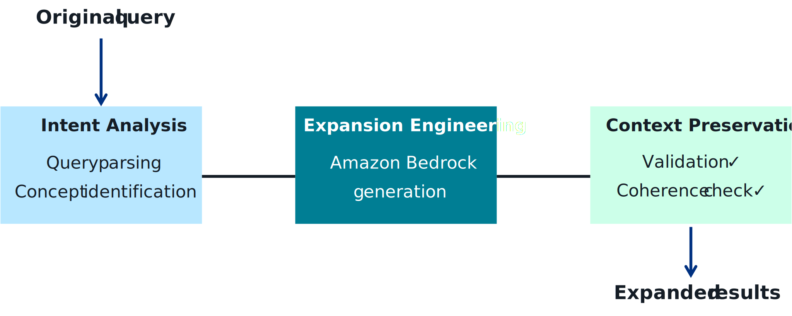
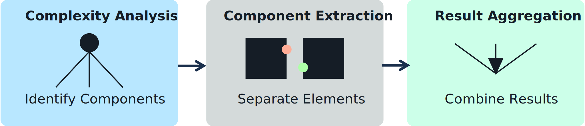
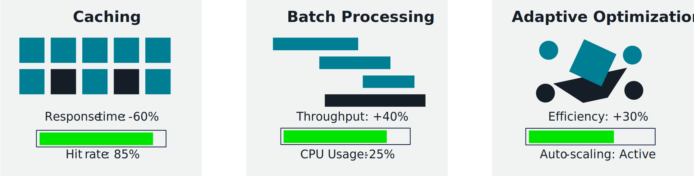
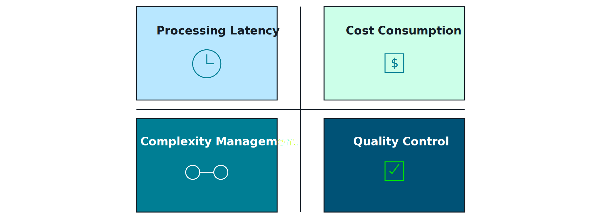

## Advanced Query Processing Techniques 🧠🔍

Advanced query processing is about **shaping and orchestrating the user query** so your retrieval stack and FMs can do their best work: expand intent, decompose complex questions, route to the right tools, and stay fast at scale.

---

## 1. Semantic query expansion 🗣️ ➜ 🧠

Goal: make the query **closer to how your data is written**, without the user needing to know exact terms.

- Techniques:
  - **Synonym & alias expansion** (e.g., “VM” → “virtual machine”, “instance”).
  - **Domain-specific term mapping** (SKU → product name; internal acronyms → full forms).
  - **Semantic expansion using FMs**:
    - Prompt an FM: “Generate related phrases, synonyms, and alternate phrasings for this query.”
  - **Multi-language expansion** for cross-lingual search.
- AWS patterns:
  - Store synonym lists in **OpenSearch**, **Aurora**, or **AppConfig**.
  - Use **Lambda + Bedrock** to do on-the-fly FM-powered expansion, then pass the enriched query to vector/keyword search.

_Diagram:_  

---

## 2. Query decomposition & orchestration 🧵🧩

Complex user requests often bundle multiple questions or tasks. Query decomposition breaks them into **manageable sub-queries** and orchestrates the workflow.

- Decomposition examples:
  - “Compare S3 and EFS for storing analytics logs and recommend the cheapest option.”
    - Sub-query 1: Retrieve docs about S3 for analytics logs.
    - Sub-query 2: Retrieve docs about EFS for analytics logs.
    - Sub-query 3: Ask FM to compare tradeoffs and cost.
  - “Summarize last quarter’s top 5 customer complaints and suggest fixes.”
    - Sub-query 1: Retrieve support tickets / summaries.
    - Sub-query 2: Cluster + summarize.
    - Sub-query 3: Ask FM for remediations.
- AWS orchestration:
  - **Step Functions** to orchestrate multi-step flows (retrieve → process → FM → combine).
  - **Lambda** tasks for each sub-step (sub-query retrieval, aggregation, enrichment).
  - Use **Bedrock** as the reasoning engine for decomposition and final synthesis.

_Diagram:_  

---

## 3. Workflow orchestration for complex queries 🏗️

For advanced retrieval workflows (tool use, multiple retrievers, external APIs), you need explicit orchestration:

- Patterns:
  - **Tool routing** – decide whether to hit vector search, keyword search, a SQL tool, or a domain microservice.
  - **Fan-out / fan-in** – run multiple retrievers in parallel and merge results.
  - **Guardrail branches** – handle sensitive topics or policy violations with alternate flows.
- AWS building blocks:
  - **API Gateway** as front door; **Lambda** for routing logic.
  - **Step Functions** as the orchestrator (Choice states, Parallel states, retries, DLQs).
  - **EventBridge** for event-driven pipelines when queries come from background jobs.

_Diagram:_  

---

## 4. Performance optimization framework 🏎️

Advanced query processing can add **latency and cost** if you’re not careful. Think in terms of:

- **Top‑k & cutoffs**
  - Keep candidate sets and reranker stages lean (e.g., 50 → 10 → 5).
- **Caching**
  - Cache frequent queries, embeddings, and partial results at API/Lambda or edge (CloudFront).
- **Model selection**
  - Use cheaper/faster models for expansion and reranking; reserve large FMs for final answers.
- **Concurrency & batching**
  - Batch embedding and rerank calls; tune Lambda concurrency and OpenSearch/DB capacity.
- **Degradation strategies**
  - If budgets/latency budgets are exceeded, skip some stages (e.g., no rerank, less context).

_Diagram:_  

---

## 5. Challenges, limitations, and tradeoffs ⚖️

Advanced query logic introduces new challenges:

- **Ambiguity & over-expansion**
  - Too much expansion → noisy results, off-topic context.
  - Mitigation: cap number of expansions, weight original terms higher.
- **Cost & latency**
  - Many FM calls per query can blow up latency and spend.
  - Mitigation: tiered models, caching, only use heavy steps for “hard” queries.
- **Explainability & debugging**
  - Harder to trace why a given result was returned.
  - Mitigation: log query transformations, scores, and tool decisions for inspection.
- **Data drift**
  - Expansion vocab and routing rules become stale as content and products change.
  - Mitigation: periodic review, metrics, and auto-updates driven by usage data.

_Diagram:_  

---

## 6. Applied example: E‑commerce product search 🛒

Bringing it all together for a realistic scenario:

- **User queries**
  - “Show me affordable waterproof hiking boots for winter.”
- **Advanced query processing steps**
  1. **Semantic expansion**
     - Expand “affordable” → price ranges; “hiking boots” → synonyms/aliases; “winter” → insulation, temperature ratings.
  2. **Query decomposition**
     - Sub-queries for product attributes (category, features) vs. user preferences (price, season).
  3. **Hybrid retrieval**
     - Use vector search for semantic match and keyword/filters for structured attributes (size, color, price, availability).
  4. **Reranking & personalization**
     - Rerank using behavior (clicks, purchases), inventory, and margin constraints.
  5. **Answer formatting**
     - Use FM to generate a friendly summary plus structured product list.

_Diagram:_  

Exam-ready takeaway: advanced query processing is how you **adapt generic retrieval to a domain**, meeting both **user intent** and **business constraints**.

