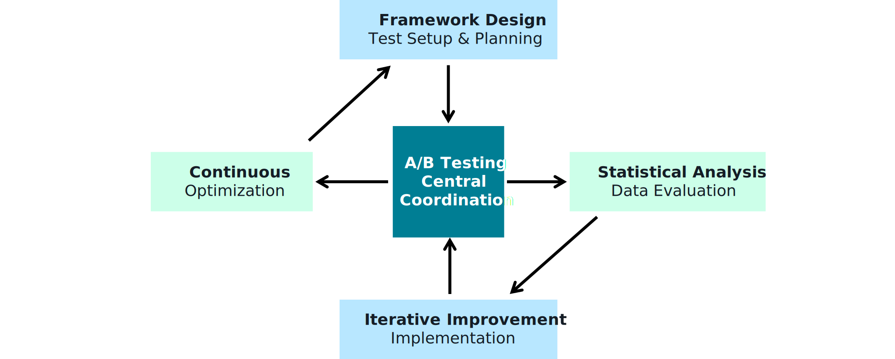
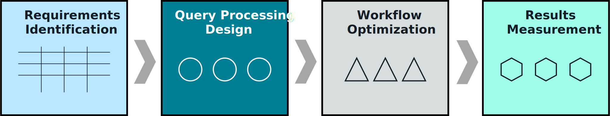

## End-to-End Query Processing Systems 🧵🧠

End-to-end query processing = **everything from user input to final answer in production**. This note ties together patterns from the previous sections into complete, testable architectures.

---

## 1. Components of an end-to-end pipeline 🧱

An AWS GenAI query processing system typically includes:

- **Entry point**
  - API Gateway / App front-end / Agent interface.
- **Query processing & routing**
  - Lambda or service that:
    - Normalizes and validates the query.
    - Applies **advanced query processing** (expansion, decomposition, routing).
    - Selects appropriate retrievers/tools (vector, keyword, SQL, APIs).
- **Retrieval layer**
  - Vector search (OpenSearch, pgvector, S3 Vectors, Bedrock KB).
  - Hybrid keyword + vector lookups with metadata filters.
- **Relevance layer**
  - Scoring, boosting, **rerankers** (traditional ML, cross-encoders, FM-based).
- **Generation layer**
  - Amazon Bedrock FM (Claude, Nova, etc.) with retrieved context.
- **Post-processing & logging**
  - Formatting, redaction, guardrails, observability, feedback capture.

_Diagram:_  

---

## 2. Strategy selection patterns 🧭

Choosing the right pattern depends on **query type, latency, and risk**:

- **Simple Q&A over docs**
  - Single retriever (Bedrock KB or OpenSearch) + FM answer generation.
- **Enterprise search with filters**
  - Hybrid keyword + vector, strong metadata filters; optional reranker.
- **Tool-heavy workflows**
  - Agent-style: FM plans → uses tools (retrievers, SQL, APIs) → synthesizes answer.
- **High-risk / regulated tasks**
  - Strict retrieval, heavy guardrails, human review or dual-control for critical actions.

## 3. Performance and reliability at system level 🚦

Beyond single-query optimization, you need **system-wide** performance & reliability:

- **Performance**
  - End-to-end latency budgets (e.g., 1–2s for chat, more for batch).
  - Caching at multiple layers (query, embedding, retrieval, FM responses where safe).
  - Autoscaling for Lambda, OpenSearch, and database backends.
- **Reliability**
  - Timeouts, retries, **circuit breakers**, and fallbacks.
  - Graceful degradation paths (simpler models/flows when under load).
  - Structured logging and tracing (X-Ray, CloudWatch) per query.

_Diagram:_  

---

## 4. Experimentation and continuous improvement 🔁

End-to-end systems should **get better over time**, not stay static:

- **A/B testing**
  - Compare ranking strategies, models, chunking configs, or KBs.
  - Route small % of traffic to new variant, measure KPIs (helpfulness, latency, cost).
- **Monitoring & feedback loops**
  - Track user feedback, failure modes, and drift in queries/content.
  - Feed logs back into relevance models, guardrails, and prompt templates.

_Diagrams:_  
  
---

## 5. Pattern recognition & future evolution 🔍➡️🚀

Over time you’ll start seeing **repeatable patterns** in queries and workflows:

- Pattern recognition
  - Common intents (FAQ, troubleshooting, data lookup, approvals).
  - Reusable subflows (retrieve → summarize, compare, explain, translate).
- Future architecture
  - Move from ad-hoc flows to **standardized query-processing components** and shared services.
  - Introduce higher-level orchestration / agent frameworks as needs mature.

## 6. Case study: Legal assistant end-to-end flow ⚖️

Conceptualizing an exam-style scenario:

- **Use case**
  - Legal team wants an assistant to answer questions about contracts and regulations.
- **End-to-end flow**
  1. **Ingestion & KB setup**
     - Contracts, statutes, case law ingested into S3 + Bedrock KB with careful chunking and metadata (jurisdiction, effective dates, document type).
  2. **Query processing**
     - User asks: “What termination rights do we have in the ACME contract signed in 2022?”
     - Advanced query processing extracts entities (ACME, termination rights, 2022) and adds filters.
  3. **Retrieval & reranking**
     - Hybrid search over KB + contract metadata; FM-based reranker promotes exact contract clauses and relevant jurisprudence.
  4. **Answer generation & guardrails**
     - Bedrock FM generates a summary, cites clauses, and clearly states uncertainty where applicable.
     - Guardrails ensure no speculative legal advice beyond the retrieved text; optional human review for high-stakes use.

_Diagram:_  

By the exam, aim to think in **full systems**: from API Gateway → Lambda/Step Functions → retrieval + rerankers → Bedrock FMs → monitoring & A/B testing, with patterns like this legal assistant as concrete mental models.

