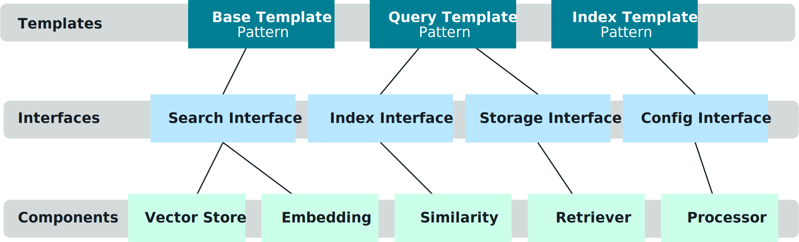
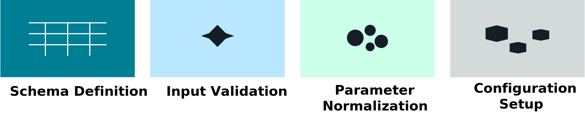
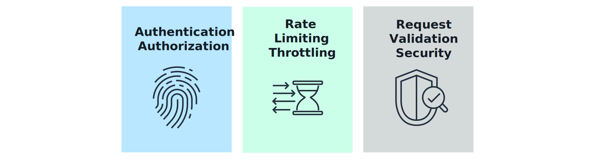
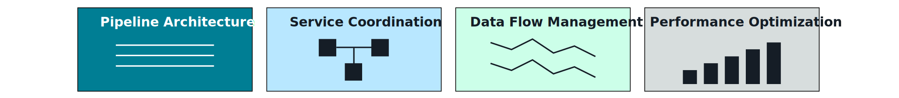
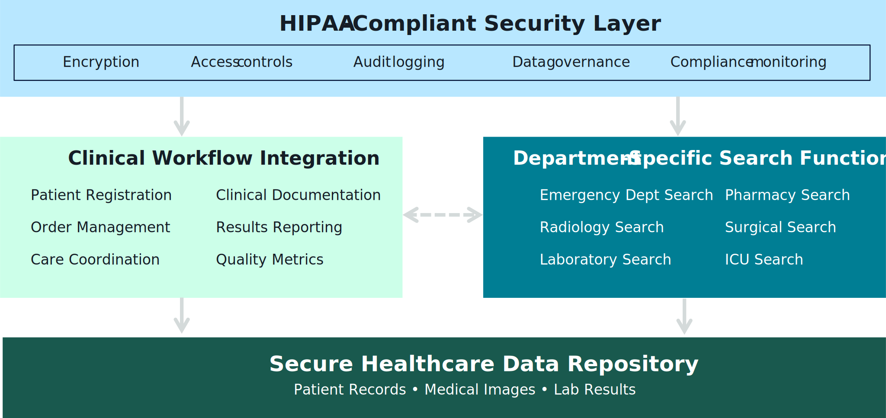

## Standardized Function Calling for Vector Search 🧩🔍

Standardizing how your FMs “call” vector search and related tools makes retrieval **reusable, safe, and easy to evolve** across apps and teams.

---

## 1. Why standardize function calling? 🎯

Without standards, every team invents its own way for FMs to:
- Call vector search / KBs.
- Pass parameters (index name, top_k, filters).
- Handle errors and timeouts.

Standardization gives you:
- **Reusable templates** for retrieval actions.
- Consistent **security & validation**.
- Easier **observability, tuning, and governance**.

_Diagram:_  

---

## 2. Designing vector search function contracts 📜

Define a stable interface (JSON schema / tool spec) for FM → retrieval calls, e.g.:

- **Function name**
  - `vector_search`, `kb_search`, `hybrid_search`, etc.
- **Inputs**
  - `query` (required) – user’s question or transformed query.
  - `top_k` – number of results; with sensible defaults and max caps.
  - `filters` – structured constraints (doc_type, region, date_range, customer_id).
  - `index` / `kb_id` – which index or KB to use.
- **Outputs**
  - List of results with: `score`, `chunk_text`, `doc_id`, `source`, `metadata`.

Best practices:
- Use **JSON schemas** and validate in Lambda before hitting the backend.
- Keep function contracts **backwards-compatible** when evolving.

_Diagram:_  

---

## 3. Securing function calls with API Gateway & IAM 🔐

Vector search functions are typically exposed as APIs:

- **API Gateway**
  - Fronts your retrieval microservice or Lambda.
  - Handles auth (Cognito/JWT), rate limiting, request/response validation.
- **IAM & VPC**
  - IAM roles for Lambda ↔ Bedrock, OpenSearch, KBs, DBs.
  - VPC endpoints for private access to Bedrock/OpenSearch/DB.
- **Guardrails in the function layer**
  - Enforce **allow-listed indices/KBs**.
  - Validate filters so FMs can’t bypass tenancy or access rules.

_Diagram:_  

---

## 4. Integrating standardized functions into end-to-end flows 🧵

Function calling patterns plug into the broader query pipeline:

- **At query time**
  - FM (via Bedrock Agents / custom orchestration) chooses `vector_search` or `kb_search` tool.
  - Passes standardized parameters (query, filters, top_k).
  - Receives results and uses them as context for answer generation.
- **Across services**
  - Multiple apps (chatbots, search UIs, agents) reuse the **same vector search function**.
  - central team maintains the implementation, security, and performance tuning.

This is how you scale **one retrieval capability** across many experiences.

_Diagram:_  

---

## 5. Domain example: Healthcare assistant 🏥

How standardized vector search functions help in a regulated domain:

- **Use case**
  - Clinicians and support staff ask questions about clinical guidelines, policies, and procedures.
- **Standardized functions**
  - `kb_search_guidelines` – scoped to clinical guidelines KB with strict filters (country, specialty, version).
  - `kb_search_policies` – scoped to organizational policies with access controls.
  - Both share a **common schema** but different backends and guardrails.
- **Benefits**
  - FMs can choose the right function based on intent.
  - Security, compliance, and audit logging are **centralized**.

_Diagram:_  

---

## 6. Exam takeaways ✅

For the exam, be ready to explain:
- Why **standardized function contracts** (names, parameters, outputs) matter for vector search and KB calls.
- How **API Gateway + Lambda + IAM** enforce security and consistency for those functions.
- How these patterns plug into **Bedrock Agents or custom orchestration** to make retrieval a reusable building block instead of a one-off integration.

If you can sketch a simple `vector_search` function spec and show where it lives in the overall architecture, you’ll be well-positioned for questions on standardized function calling for vector search.

