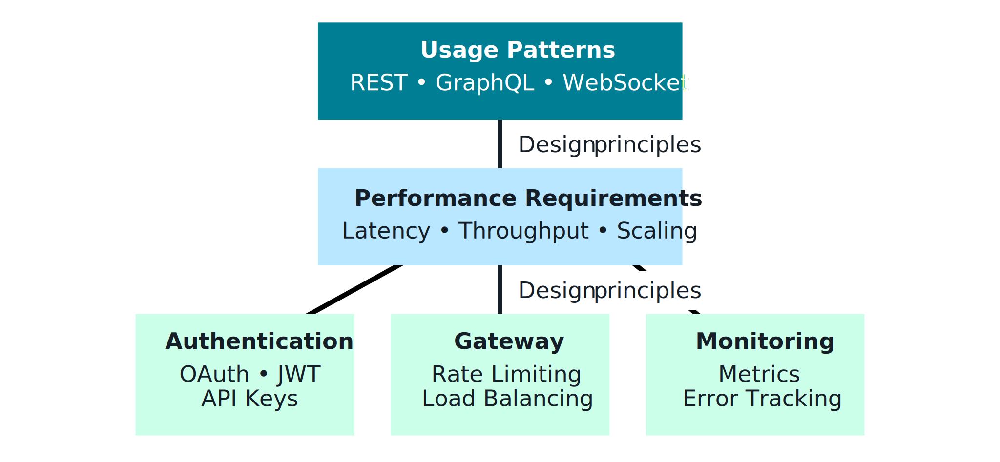
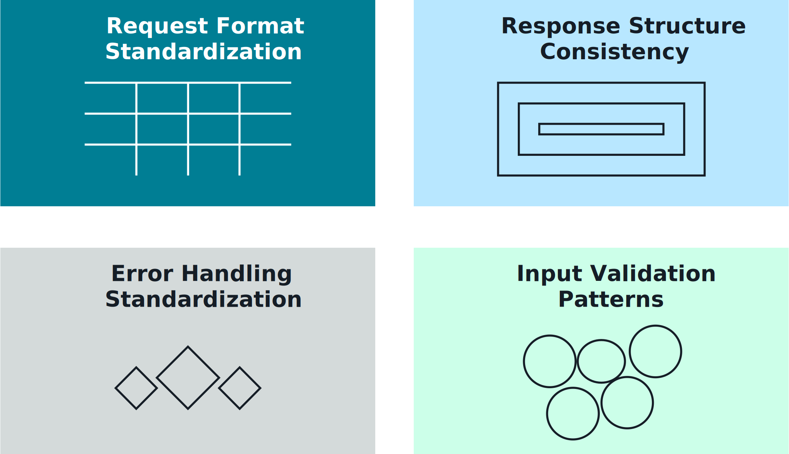
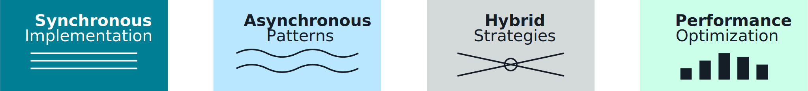
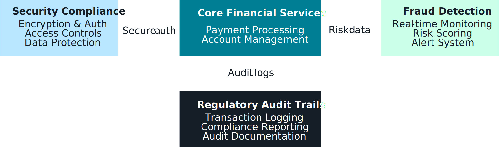

## API Patterns for Retrieval Augmentation 🌐🔎

This note focuses on **how you expose retrieval and RAG capabilities via APIs** so many clients (apps, agents, services) can use them in a consistent, secure way.

---

## 1. Core API design for retrieval augmentation 🧱

Key principles when designing retrieval/RAG APIs:
- **Separation of concerns**
  - Keep retrieval APIs separate from generation APIs when helpful (e.g., `/search` vs `/chat`).
  - Or provide a combined `/rag/query` that orchestrates both behind the scenes.
- **Clear resource and operation model**
  - `POST /vector-search`, `POST /kb-search`, `POST /rag/query`, etc.
  - Use well-defined JSON bodies for queries, filters, and options.
- **Consistency across services**
  - Standardize field names (`query`, `top_k`, `filters`, `index`, `context_length`).
  - Use shared error formats and status codes.

_Diagram:_  

---

## 2. Request/response standardization 📜

Standardized schemas make it easier to:
- Swap backends (OpenSearch ↔ KB ↔ pgvector).
- Evolve implementations without breaking clients.
- Add routing/feature flags at the API layer.

**Request patterns:**
- **Retrieval-only**
  - `query`: user’s text.
  - `top_k`: number of results (with safe bounds).
  - `filters`: structured constraints.
  - `retrieval_mode`: `vector`, `keyword`, `hybrid`.
- **RAG (retrieve+generate)**
  - Retrieval fields above, plus:
  - `generation_model`, `temperature`, `max_tokens`, etc.

**Response patterns:**
- `results`: list of hits with `score`, `snippet`, `doc_id`, `source`, `metadata`.
- Optional `answer`: FM-generated answer text.
- Optional `trace`: debug info (retriever choice, latencies, tool calls) for observability.

_Diagram:_  

---

## 3. Processing patterns & workflows ⚙️

Common API-level patterns for retrieval augmentation:

- **Synchronous request/response**
  - One call does: query processing → retrieval → rerank → generation → answer.
  - Best for interactive UX; control total latency budget carefully.
- **Async / job-based**
  - Client submits long-running RAG job, polls `GET /rag/jobs/{id}` or uses callbacks.
  - Useful for bulk summarization, report generation, or large document QA.
- **Pipeline APIs**
  - Separate endpoints for staged flows: `/process/query`, `/retrieve`, `/rerank`, `/generate`.
  - Used internally when multiple teams/services share components.

_Diagram:_  

---

## 4. OpenAPI & contract-first development 📘

Using **OpenAPI** (Swagger) to define retrieval/RAG APIs gives you:
- Single source of truth for:
  - Endpoints and methods.
  - Request/response schemas.
  - Auth requirements and error models.
- Auto-generated:
  - Client SDKs for multiple languages.
  - Mock servers and API documentation.

Recommended approach:
- Design APIs **contract-first** in OpenAPI.
- Use code generation + infrastructure as code (CDK/Terraform) for consistent deployments.

_Diagram:_  

---

## 5. End-to-end API architecture for retrieval augmentation 🧵

Putting it together on AWS:
- **API Gateway**
  - Public or private entrypoint, authN/Z (Cognito, JWT), rate limiting, validation.
- **Lambda / microservices**
  - Implement query processing, tool routing, retrieval, reranking, and FM calls.
- **Backends**
  - OpenSearch / pgvector / S3 Vectors / Bedrock KB for retrieval.
  - Bedrock FMs for generation and reranking.
- **Observability**
  - Structured logging for each stage, correlation IDs, metrics (latency, errors, cost).

_Diagram:_  

---

## 6. Domain example: Financial services agent 💳

An example of API patterns applied to a financial-services use case:

- **APIs**
  - `/customer-support/query` – RAG endpoint for customer and agent questions.
  - `/knowledge/search` – retrieval-only endpoint used by internal tools.
- **Behavior**
  - RAG API:
    - Validates query, extracts account-safe context (no direct PII from user input).
    - Routes to appropriate KBs (products, policies, procedures) with filters (region, product line).
    - Uses vector + keyword hybrid retrieval, FM-based reranker, then FM for final answer.
    - Logs answer, citations, and confidence for audit and model improvement.

_Diagram:_  

---

## 7. Exam-ready takeaways ✅

Be able to:
- Sketch a simple **API contract** for retrieval or RAG (fields, responses, error shapes).
- Explain how **API Gateway + Lambda + backend services** implement those APIs securely.
- Show how standardized, contract-first APIs let **multiple clients and agents** share the same retrieval augmentation capabilities across the organization.

If you can talk through these patterns with concrete examples, you’ll be in a strong position for API-related questions on retrieval augmentation.

