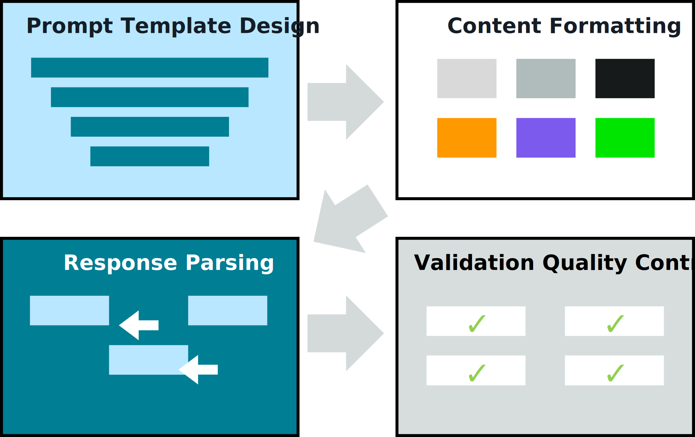
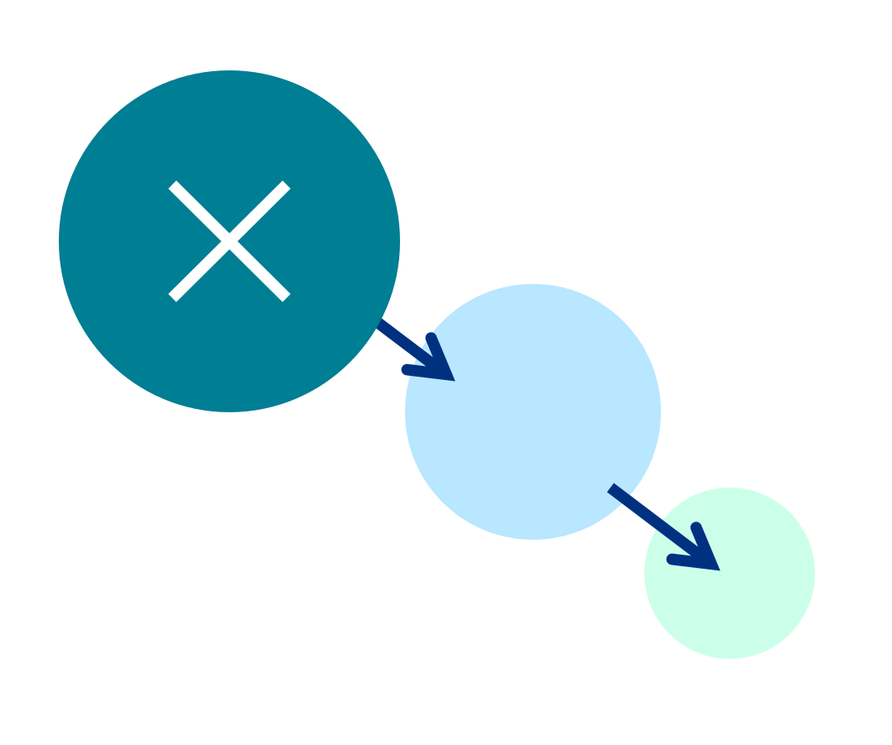
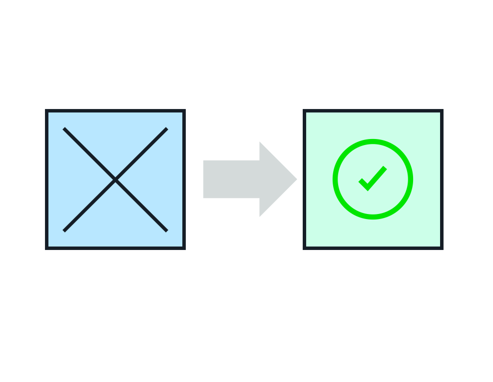

## Integration with Foundation Models 🤝🧠

This note focuses on how to **safely and robustly integrate retrieval pipelines with FMs**, including input formatting, pre/post-processing, and resilience patterns (failure detection, fallback, recovery).

---

## 1. Integration requirements & contracts 📜

Before wiring FMs into your retrieval stack, define clear **integration requirements**:
- **Input contracts**
  - Prompt structure (system/instruction, context, user query).
  - Max tokens, allowed tools/functions, required metadata (citations, trace IDs).
- **Output contracts**
  - Expected JSON schemas or text formats.
  - Requirements for citations, confidence signals, and guardrail flags.
- **Non-functional requirements**
  - Latency SLAs, throughput targets, cost budgets.
  - Error handling and retry policies.

_Diagram:_  

---

## 2. Input formatting & pre-processing 🧹

Good integration starts with **well-structured inputs** to the FM:
- **Prompt templates**
  - Standardize templates for Q&A, summarization, comparisons, classifications.
  - Ensure retrieved context is clearly separated from instructions and user query.
- **Context packaging**
  - Concatenate top‑k chunks with headings, sources, and separators.
  - Include metadata (doc titles, dates, jurisdictions) where relevant.
- **Guardrails in pre-processing**
  - Redact PII where necessary.
  - Add system instructions enforcing policy boundaries.

_Diagrams:_  
  

---

## 3. Post-processing & enhancement 🎨

After the FM responds, **post-processing** turns raw output into production-grade responses:
- **Validation**
  - JSON schema validation for structured outputs.
  - Sanity checks on ranges, enums, and required fields.
- **Enrichment**
  - Attach citations and links back to retrieved sources.
  - Normalize formats (dates, currencies, IDs) to system standards.
- **Safety & compliance checks**
  - Run guardrail checks; strip disallowed content or route to human review.
- **UX formatting**
  - Convert raw text into structured UI components (bullets, tables, highlights).

_Diagram:_  

---

## 4. Resilience: failure detection, fallback, and recovery 🧯

FMs and retrieval backends can fail or degrade; design patterns to handle this:

- **Failure detection**
  - Monitor error rates, timeouts, and quality signals (low-confidence answers, guardrail violations).
  - Detect backend issues (OpenSearch/DB errors, Bedrock throttling) early.

_Diagram:_  

- **Fallback strategies**
  - **Progressive fallback**:
    - Try primary flow (full RAG + FM); if it fails or exceeds latency budget, fall back to:
      - Simpler models or prompts.
      - Retrieval-only answers or links.
      - Cached or precomputed FAQs.
  - **Partial functionality**:
    - Provide at least search results or doc links when generation is unavailable.

_Diagrams:_  
  

- **Recovery & restore**
  - Automate recovery steps (circuit breakers, health checks, warm restarts).
  - Restore degraded services and gradually return traffic to normal flows.

_Diagram:_  

---

## 5. Unified APIs for FM integration 🌐

For multiple teams to integrate safely with FMs:
- Expose **unified, contract-based APIs** (e.g., `/rag/query`, `/summarize`, `/classify`) that encapsulate:
  - Retrieval, pre-processing, FM calls, and post-processing.
  - Guardrails, logging, and observability.
- Keep FM vendor/model details behind the API boundary so you can:
  - Swap models/providers.
  - Update prompts/guardrails without breaking clients.

_Diagram:_  

---

## 6. Exam-ready framing ✅

For Integration with Foundation Models questions, be ready to:
- Describe **input/output contracts**, pre-/post-processing pipelines, and how they protect reliability and safety.
- Explain resilience patterns (failure detection, progressive fallback, partial functionality, recovery).
- Show how unified APIs + strong contracts let many services safely reuse FM-powered retrieval augmentation.

Think of integration as making FMs behave like **robust, well-specified services** in your architecture—not magic boxes. 

