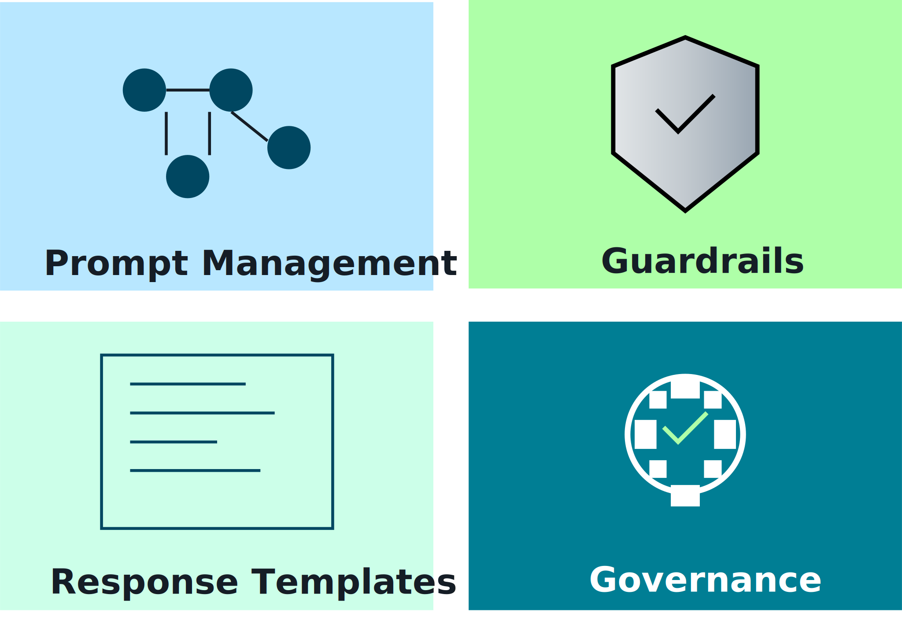
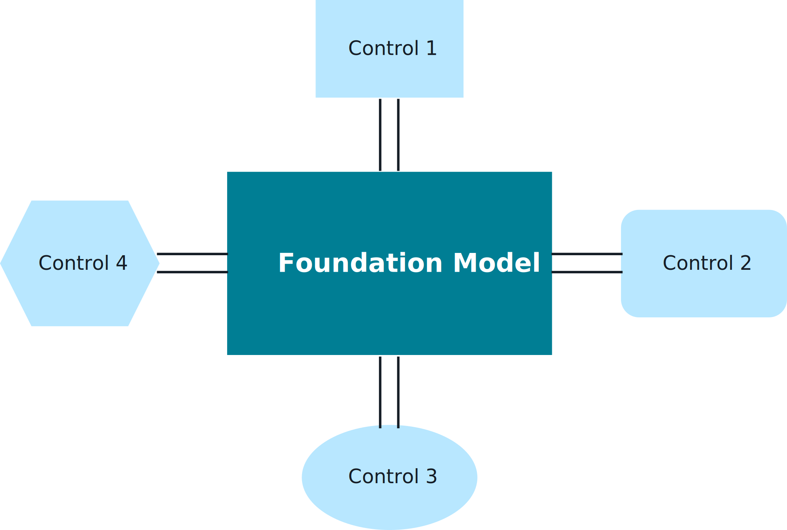

## Instruction Framework Fundamentals 🧭✍️

Instruction frameworks turn “one-off prompts” into **repeatable, governed patterns** for controlling foundation models at scale.

---

## 1. Why you need an instruction framework 🎯

As usage grows, ad-hoc prompts cause:
- Inconsistent behavior across teams and apps.
- Hard-to-debug regressions when models or prompts change.
- Governance gaps (no clear mapping from business policy → model instructions).

An instruction framework provides:
- **Standard building blocks** (roles, behaviors, style, constraints).
- **Templates** for common task types (Q&A, summarize, classify, route, transform).
- **Versioned, testable prompts** managed like code/config.

_Diagram:_  

---

## 2. Core elements of an instruction framework 🧱

Typical components:
- **Role & persona**
  - Who is the model acting as? (support agent, compliance analyst, data steward, tutor).
- **Objectives & success criteria**
  - What does “good” look like? (accuracy, tone, structure, citations, safety).
- **Guardrails & policies**
  - What must the model *not* do? (legal advice, PII exposure, policy violations).
- **Input & context specification**
  - How retrieval results, user input, and metadata are presented.
- **Output format**
  - JSON schemas, markdown templates, or UI-oriented structures.

These are expressed as **prompt templates + configuration**, not scattered one-off strings.

---

## 3. Foundation model control framework 🛡️

Instruction frameworks sit inside a broader **control framework** for FMs:

- **Policy layer**
  - Business policies, regulatory constraints, brand guidelines.
- **Instruction & prompt layer**
  - Concrete system prompts and templates encoding those policies.
- **Guardrails & filters**
  - Safety classifiers, content filters, topic blocks.
- **Monitoring & feedback**
  - Human review, red-teaming, incident handling, and prompt/model refinements.

_Diagram:_  

This stack makes FM behavior **predictable, auditable, and improvable** over time.

---

## 4. How this ties into retrieval & RAG 🔗

For retrieval-augmented systems, instruction frameworks define:
- How retrieved context is introduced (citations, doc types, timestamps).
- How strictly the model must **stick to retrieved content** vs. general knowledge.
- How to behave when:
  - No good evidence is found (ask for clarification, say “I don’t know,” or route to human).
  - Conflicting evidence appears (flag ambiguity, present options).

On the exam, expect to connect **prompt/Instruction design** with **retrieval behavior**, guardrails, and system reliability.

---

## 5. Exam-ready points ✅

Be able to explain:
- Why enterprises move from “clever prompts” to **structured instruction frameworks**.
- The core elements (role, objectives, guardrails, input/output contracts) and how they map to business policy.
- How instruction frameworks and control frameworks help make FM behavior **consistent, governed, and testable**, especially in RAG systems.

