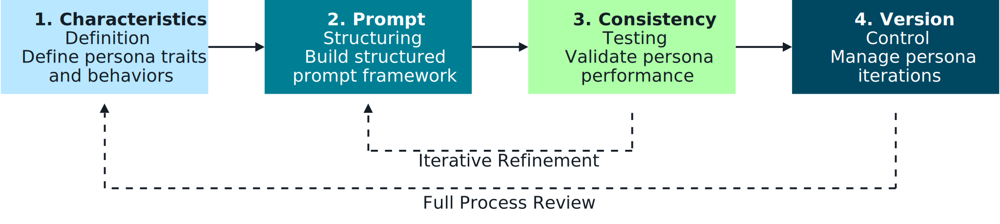
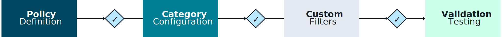
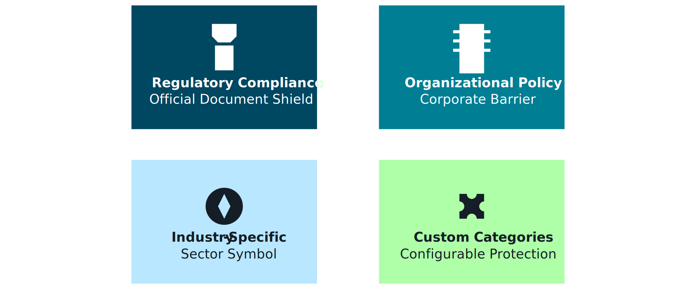
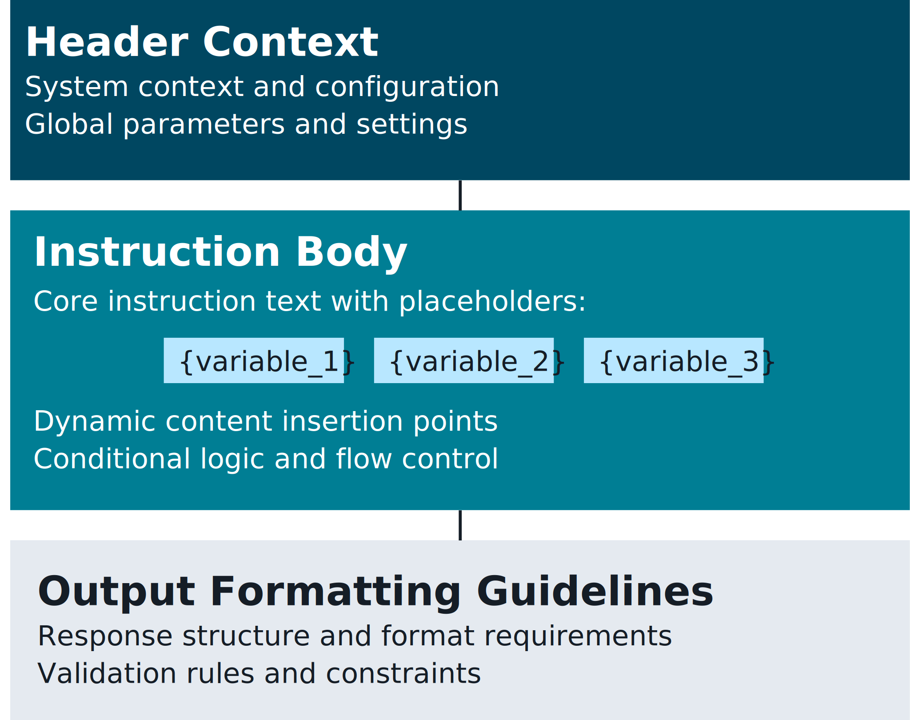
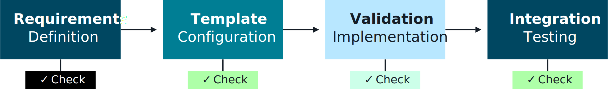
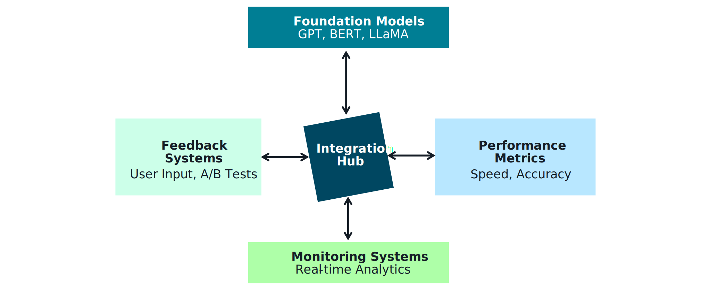

## Controlling Foundation Model Behavior with Amazon Bedrock 🎛️

Amazon Bedrock gives you **control levers** to turn a “generic” foundation model into a **governed enterprise assistant** that behaves consistently, safely, and in line with your policies.

Think of this file as the **Bedrock control layer** on top of the instruction framework from `01 Instruction_Framework_Fundamentals.md`.

---

## 1. Why behavior control matters ⚖️

Uncontrolled FM behavior leads to:
- **Inconsistent answers** across channels and teams.
- **Compliance and brand risk** (PII leaks, sensitive topics, off-policy recommendations).
- **Hard-to-audit decisions** — no clear link between outputs and your policies.

Bedrock helps you enforce:
- **Safety & policy alignment** via Guardrails and content filters.
- **Consistent structure** via prompt templates and structured outputs.
- **Governance & oversight** via centralized configuration, versioning, and monitoring.

---

## 2. Core control levers in Amazon Bedrock 🧰

At a high level, you combine:

- **Instruction frameworks**  
  Roles, objectives, guardrails, input/output contracts (from file `01`).

- **Prompt templates & model personas**  
  How you express system instructions + user/task context.

  _Diagram:_  
  

- **Guardrails**  
  Policy-based controls for topics, PII, safety thresholds, and allowed behaviors.

- **Structured output controls**  
  JSON/typed schemas, tools/function calling, and validators to constrain shapes of responses.

- **Monitoring and feedback loops**  
  CloudWatch, audit logs, evaluations, and human-in-the-loop review.

Together, these map business policy → **repeatable, testable FM behavior**.

---

## 3. Guardrails: controlling *what* the model is allowed to say 🛡️

Bedrock Guardrails let you encode **safety and compliance policies** directly into inference:

- **Content filtering**
  - Block or transform harmful content (hate, violence, self‑harm, sexual content, etc.).
  - Configure thresholds per dimension (e.g., block high-risk, log medium-risk).

  _Diagram:_  
  

- **Topic restrictions**
  - Define **allowed / disallowed** topics (e.g., “no legal advice”, “no medical diagnosis”).
  - Useful for OWASP / CWE‑driven controls where certain “classes” of behavior are disallowed.

  _Diagram:_  
  

- **Sensitive data controls**
  - Detect and redact **PII, PHI, financial data, secrets** before they leave the system.
  - Combine with IAM + network boundaries for end‑to‑end data protection.

**Where Guardrails apply**
- Direct Bedrock API calls (runtime).
- Bedrock **Knowledge Bases** and **Agents**.
- Multi-step workflows (e.g., Step Functions) when each FM call is guarded.

> **Exam lens:** be ready to describe how Guardrails + IAM + network isolation work together to mitigate OWASP Top 10 / CWE Top 25 style risks (injection, data leakage, broken access control, etc.).

---

## 4. Prompt templates & structured outputs 🧩

You control *how* the model reasons and responds using **prompt templates** and **structured output patterns**.

### 4.1 Prompt template structure

Typical Bedrock template:
- **System / instruction block** – role, tone, constraints, safety rules.
- **Context block** – retrieved documents, metadata, prior steps.
- **User/task block** – the actual question or action.
- **Output contract** – JSON schema or markdown structure to follow.

_Diagram:_  

This aligns directly with the **instruction framework building blocks** from file `01`.

### 4.2 Structured output process

To reduce hallucinations and parsing errors, you:
- Ask the model to respond in **strict JSON** or a typed schema.
- Optionally use Bedrock tools / function calling for more control.
- Validate outputs with application-side schemas before using them.

_Diagram:_  

Benefits:
- Easier **downstream integration** (APIs, workflows, databases).
- More reliable **governance checks** (e.g., validations, policy engines).
- Better **observability** of behavior changes over time.

---

## 5. Integration & optimization framework 🔁

Controlling behavior doesn’t stop at a single prompt. You embed Bedrock into a **full stack**:

- **Entry points**
  - API Gateway, AppSync, custom backends, or event-driven Lambda.
- **Policy and control layer**
  - Guardrails, instruction frameworks, and AppConfig feature flags.
- **Retrieval & data layer**
  - RAG over vector stores/KBs with clear context contracts.
- **Monitoring & optimization**
  - Logs, metrics, traces, and evaluation pipelines to tune prompts, Guardrails, and routing.

_Diagram:_  

This is where **model routing, circuit breakers, and graceful degradation** (from earlier sections) connect back into **prompt governance and behavior control**.

---

## 6. Governance and oversight 🧬

To make Bedrock-based systems **auditable and exam‑ready**, you need strong governance:

- **Centralized configuration**
  - Store Guardrail configs, prompt templates, and model choices in **versioned config** (e.g., Git + AppConfig).
  - Tag configurations with environment (dev/test/prod) and business owner.

- **Change management**
  - Treat prompt + Guardrail changes like **code changes**:
    - Pull requests, approvals, CI checks.
    - Regression evaluations against test suites before rollout.

- **Monitoring & incident response**
  - Log Guardrail triggers, blocked requests, and overrides.
  - Define escalation paths when content is repeatedly blocked or policies are violated.

- **Alignment with security standards**
  - Map risks and controls to **OWASP Top 10** and **CWE Top 25** to show coverage.
  - Document how Guardrails, IAM, network controls, and logging reduce attack surface.

On the exam, expect questions that connect **instruction frameworks + Guardrails + governance** into a single **end‑to‑end control story**.

---

## 7. Flashcards – Controlling behavior with Bedrock 🧠📚

Use these like quick review cards:

- **Q1. What are the three main Bedrock levers for controlling FM behavior?**  
  **A1.** Instruction frameworks (prompts/templates), Guardrails (safety/policy), and structured outputs (schemas/tools + validation).

- **Q2. How do Guardrails reduce enterprise risk?**  
  **A2.** By enforcing topic restrictions, content filters, and sensitive data controls at inference time, blocking or transforming unsafe outputs aligned with security and compliance requirements.

- **Q3. Why are structured outputs important for governance?**  
  **A3.** They make responses machine‑checkable, enabling schema validation, policy engines, and consistent downstream automation.

- **Q4. What is the relationship between instruction frameworks and prompt templates?**  
  **A4.** Instruction frameworks define the **conceptual building blocks** (roles, objectives, guardrails, IO contracts), while prompt templates are the **concrete realizations** of those instructions per task or use case.

- **Q5. How does governance and oversight show up in a Bedrock solution?**  
  **A5.** Through versioned configs, change management, monitoring of Guardrail events, mapped risks/controls (e.g., OWASP/CWE), and documented runbooks for handling incidents or regressions.

