## Interactive AI Systems – Building Conversational Systems 🗣️🤖

Interactive AI systems turn foundation models into **conversational experiences** – chatbots, copilots, and virtual agents that feel responsive, safe, and context-aware.

This page summarizes the **architecture, decision-making, and context strategies** for building such systems in an exam-ready, flashcard-friendly way.

---

## 1. High-level architecture for conversational systems 🏗️

Typical building blocks:
- **Channels & clients** – web/mobile/chat widgets, contact center UIs.
- **API & routing layer** – API Gateway / ALB → Lambda or container services.
- **Conversation orchestration** – dialogue manager, state machine, or agent framework.
- **Foundation models** – Amazon Bedrock FMs for NLU, generation, tools.
- **Context & memory** – DynamoDB, vector stores, Bedrock Knowledge Bases, S3.
- **Observability & governance** – logging, metrics, Guardrails, evaluation.

_Diagram:_  

Key idea: separate **UI, orchestration, models, and data** so you can evolve each independently.

---

## 2. Conversation management & decision flow 🔁

A robust conversational system doesn’t just “generate text”; it runs a **decision loop** each turn:

1. **Ingest user input** (text, voice, structured events).
2. **Identify intent & entities** (FM classification + rules/heuristics).
3. **Decide next action** – answer directly, call a tool/API, ask clarification, escalate.
4. **Update conversation state** – memory, context records, user profile.
5. **Generate response** using Bedrock with the updated state + policies.

_Diagram:_  
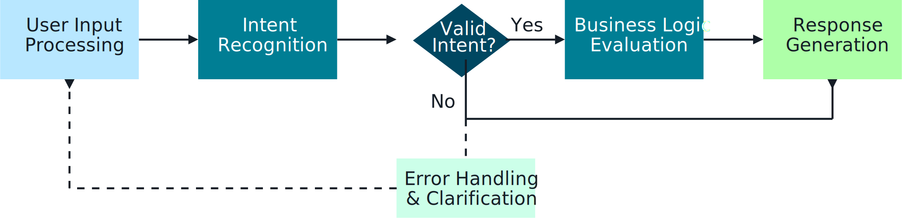

_Decision brain:_  
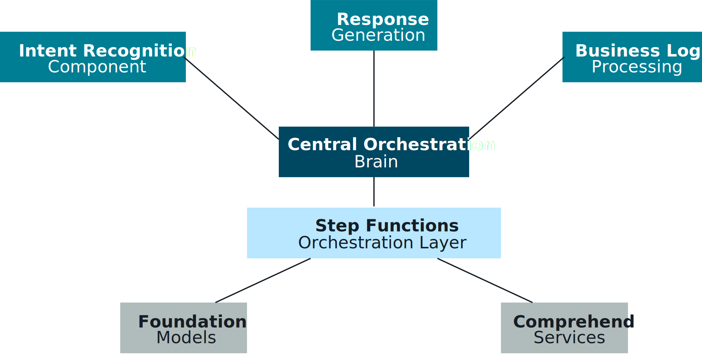

For the exam, remember: **intent understanding + stateful decisioning** are as important as the FM itself.

---

## 3. Intent recognition patterns 🧭

You often combine **Bedrock FMs** with more deterministic components:

- **FM-only intent recognition**
  - Use Bedrock to classify the user request into one of many intents.
  - Fast to iterate; may need Guardrails + validation for safety.

- **Hybrid intent recognition**
  - Combine **rules/regex** for known patterns (e.g., “reset password”) with **FM classification** for open-ended queries.
  - Best of both worlds: precision for critical flows, flexibility elsewhere.

_Diagram:_  
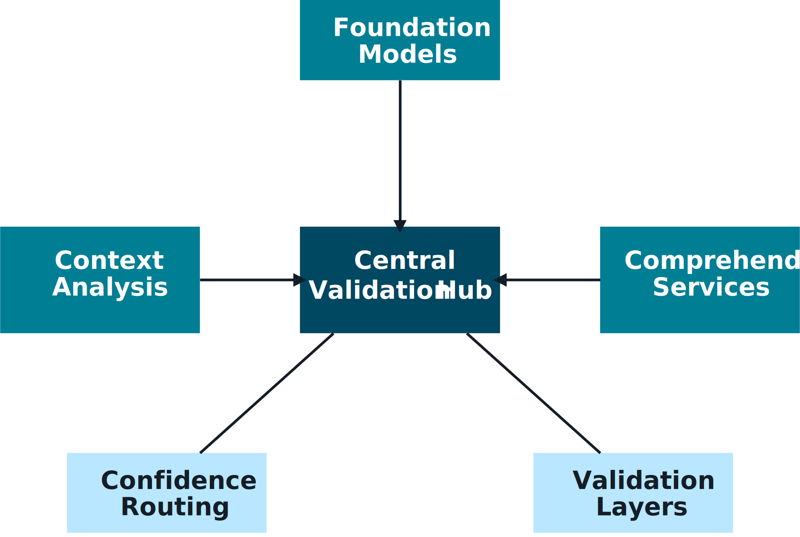

- **Parallel intent analysis**
  - Run multiple detectors in parallel (FM classifier, keyword/rule engine, sentiment detector).
  - Aggregate results to choose the most confident or safest path.

_Diagram:_  
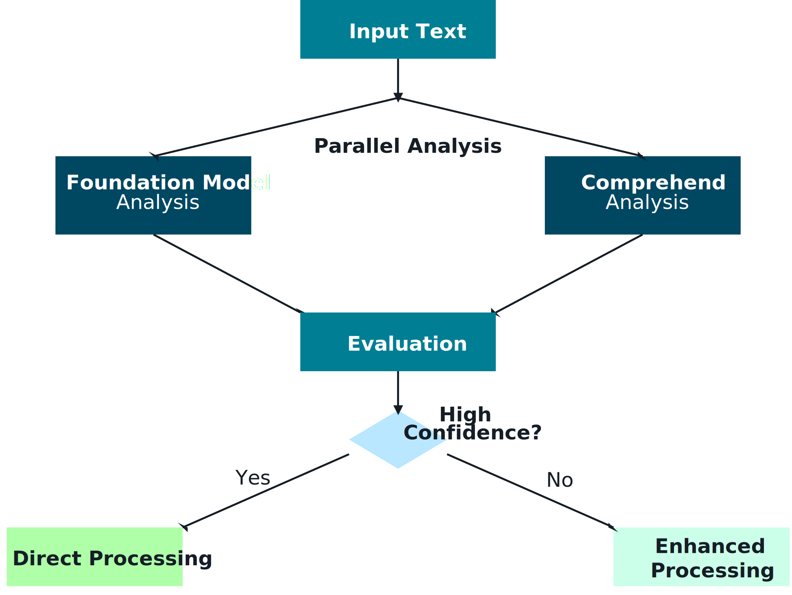

_Foundation model in the loop:_  
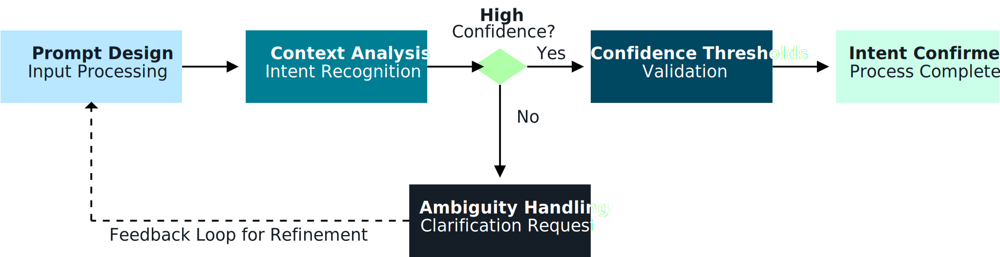

---

## 4. Designing effective context & memory 🧠

Conversational systems rely on **short-term dialogue context** and **long-term memory**:

- **Context storage architecture**
  - Use **DynamoDB** (or similar) to store turns, slots, and session metadata.
  - Link to S3 documents, vector stores, and transactional systems.

  _Diagram:_  
  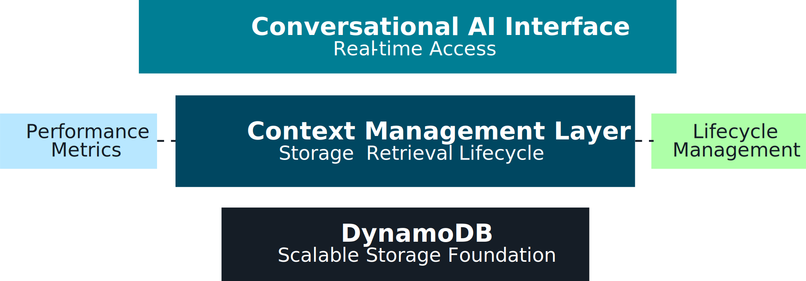

- **Schema design**
  - Capture **who/what/when/why** for each turn and decision.
  - Keep keys query-friendly (userId, sessionId, conversationId).

  _Diagram:_  
  

- **Context selection strategies**
  - Don’t send the entire history to the model; select only the **relevant slices**:
    - Last N turns.
    - Important milestones (decisions, escalations).
    - Retrieved knowledge from KB/RAG.

  _Diagram:_  
  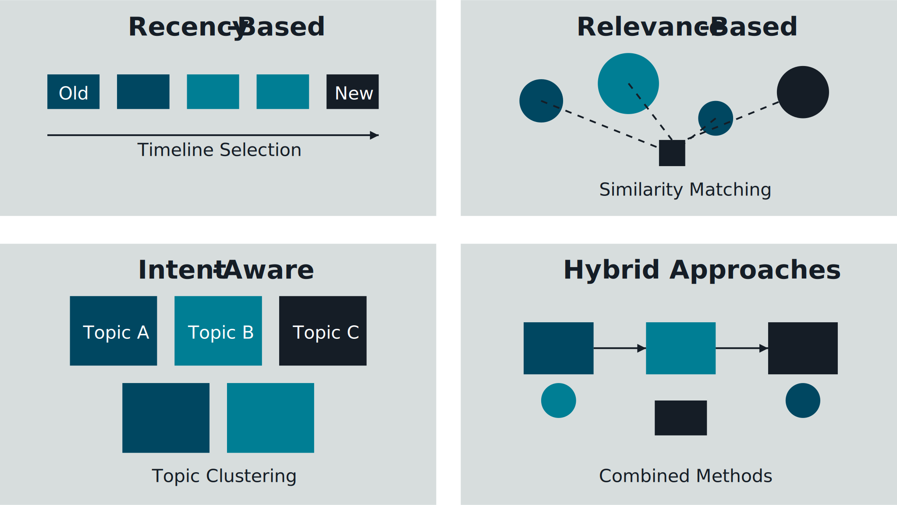

- **Efficient retrieval & lifecycle**
  - Use **secondary indexes** and **efficient retrieval strategies** for low-latency context lookups.
  - Apply **TTL and archiving** to manage cost and comply with retention policies.

  _Diagrams:_  
  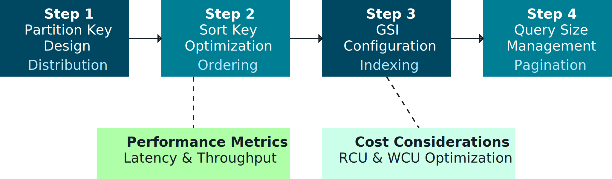  
  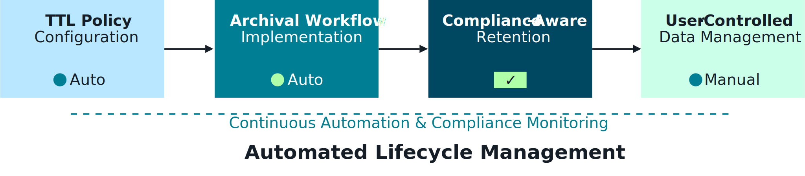

For exams, connect context design back to **RAG patterns, data quality, and governance** from earlier sections.

---

## 5. Key architectural components & resilience 🧩

Interactive systems must be **resilient and secure**:

- **Key architectural components**
  - Entry APIs, orchestrator, FM calls, tools/APIs, context store, logging/metrics.

  _Diagram:_  
  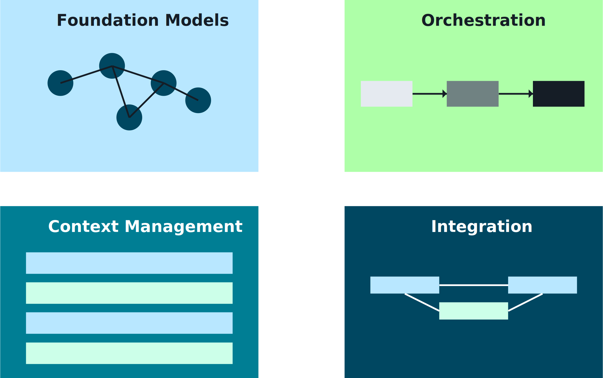

- **System resilience**
  - Use **circuit breakers, timeouts, retries**, and **fallbacks** (simpler flows, cached responses).
  - Design for partial failure (e.g., FM unavailable → handoff to human or static FAQ).

  _Diagram:_  
  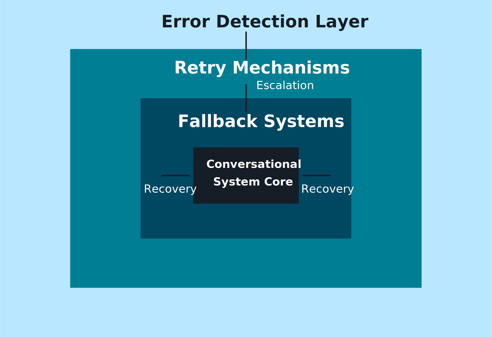

- **Security & compliance**
  - Enforce IAM, network isolation, encryption, and Bedrock Guardrails.
  - Map to **OWASP Top 10 / CWE Top 25** style risks (injection, access control, data exposure).

  _Diagram:_  
  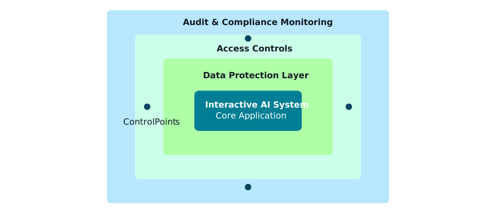

---

## 6. Flashcards – Interactive & conversational systems 📚

- **Q1. What are the core layers of an interactive AI architecture?**  
  **A1.** Channels/clients, API & routing, conversation orchestration, foundation models (Bedrock), context & memory stores, and observability/governance.

- **Q2. Why is intent recognition often hybrid (rules + FM)?**  
  **A2.** Rules give precise control for critical flows, while FMs handle open-ended, long-tail queries; combining them balances safety and flexibility.

- **Q3. What makes context storage “good” for conversational systems?**  
  **A3.** Clear schemas, efficient access patterns, selective context retrieval, and lifecycle controls (TTL/archiving) aligned with compliance.

- **Q4. How do resilience patterns show up in conversational systems?**  
  **A4.** Through circuit breakers, timeouts, retries, degraded modes, and human handoff when FM or downstream services fail.

- **Q5. How do interactive systems tie back to governance topics?**  
  **A5.** They apply Guardrails, logging, access controls, and evaluation pipelines so every conversation is **safe, auditable, and policy-aligned**.

