## Comprehensive Prompt Management 📦🧠

Prompt management is about treating prompts like **first-class assets** – versioned, tested, governed, and shared across teams – instead of ad‑hoc strings hidden in code.

This section connects **prompt lifecycle, collaboration, deployment, and governance** into one exam-ready view.

---

## 1. Prompt management architecture 🏗️

Core layers in a prompt management system:
- **Authoring & templates** – where prompts and instruction frameworks are created.
- **Storage & version control** – Git, config repos, or prompt registries.
- **Validation & testing** – automated checks before rollout.
- **Deployment & runtime configuration** – how prompts reach apps and services.
- **Monitoring & feedback** – logs, evaluations, human review.

_Diagram:_  
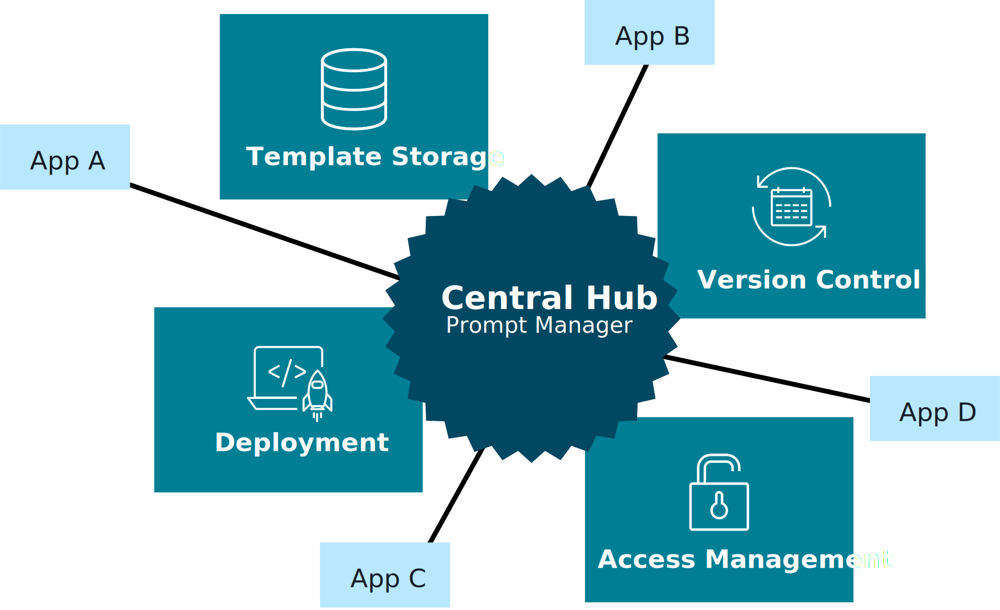

Key idea: prompts move through a **pipeline** just like application code.

---

## 2. Template creation & collaboration ✍️🤝

### 2.1 Template creation process

Good templates encode:
- Clear **roles & objectives** (from your instruction framework).
- Input/output contracts (JSON/markdown formats).
- Guardrails, tone, and domain constraints.

_Diagram:_  
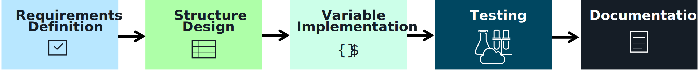

### 2.2 Collaboration framework

Prompt work is **multi-disciplinary**:
- Product + SMEs define requirements and guardrails.
- Prompt engineers translate them into templates.
- Developers integrate templates with apps and retrieval.
- Risk/compliance teams review sensitive flows.

_Diagram:_  
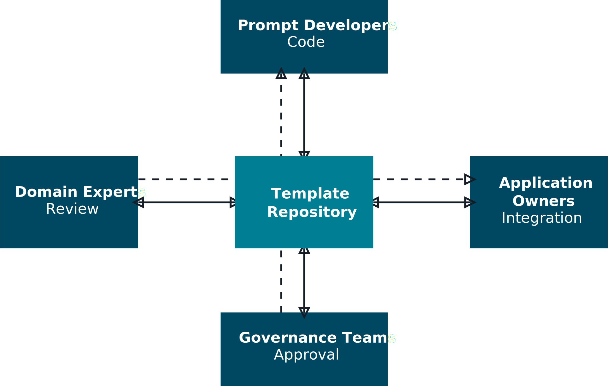

On the exam, relate this to **governance and oversight**: who owns which prompts, and how changes are approved.

---

## 3. Version control & testing 🔄✅

### 3.1 Version control workflow

Treat prompts like code:
- Store templates in **Git or a central repo** (YAML/JSON/Markdown).
- Use branches, PRs, and reviews for changes.
- Tag versions by environment (dev/test/prod) and experiment.

_Diagram:_  
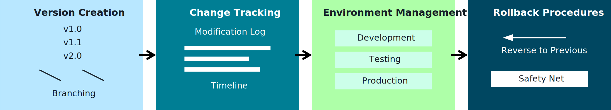

### 3.2 Validation framework

Before rolling out a prompt:
- Run **linting and schema checks** on template structure.
- Execute **test suites** with representative inputs.
- Evaluate **quality, safety, latency, and cost** metrics.

_Diagram:_  
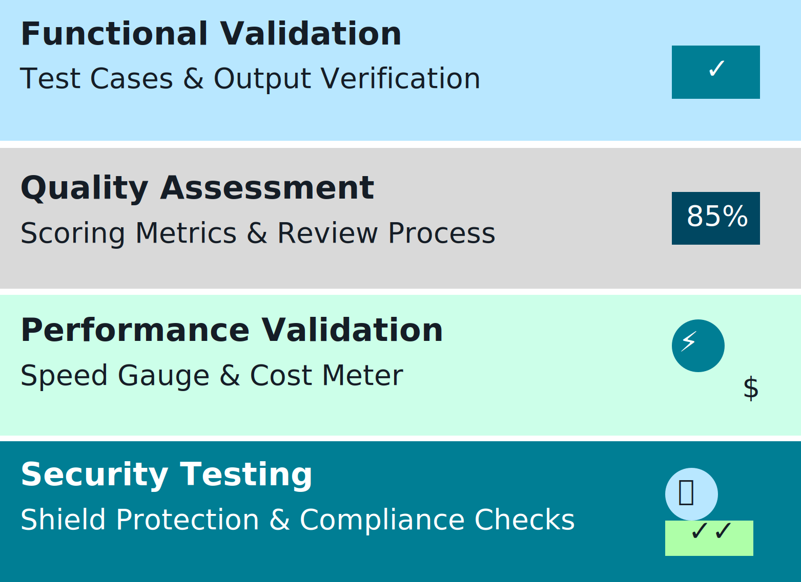

These steps plug into CI/CD and Bedrock model evaluation tools.

---

## 4. Deployment strategies & runtime configuration 🚀

You need safe ways to roll prompts into production:

- **Deployment strategies**
  - Blue/green or canary deployments for prompt versions.
  - Gradual rollout for high-risk prompts (compliance, finance, healthcare).

  _Diagram:_  
  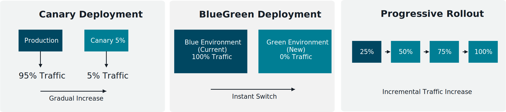

- **Runtime configuration**
  - Use **AWS AppConfig** or config services to:
    - Select prompt versions per environment, tenant, or experiment bucket.
    - Toggle features, models, or guardrail settings without redeploying code.

Prompt management + runtime config = **safe experimentation** and fast iteration.

---

## 5. Advanced governance & compliance 🛡️📜

Prompt management ties directly into **enterprise governance**:

- **Advanced governance strategies**
  - Standardize prompt patterns (e.g., RAG Q&A, classification, summarization).
  - Define approval workflows for high-impact prompts.
  - Track lineage from **business policy → prompt → model behavior**.

  _Diagram:_  
  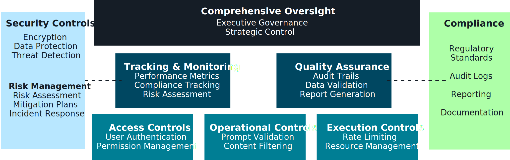

- **Governance architecture patterns**
  - Centralized vs. federated vs. hybrid governance across teams and regions.

  _Diagrams:_  
  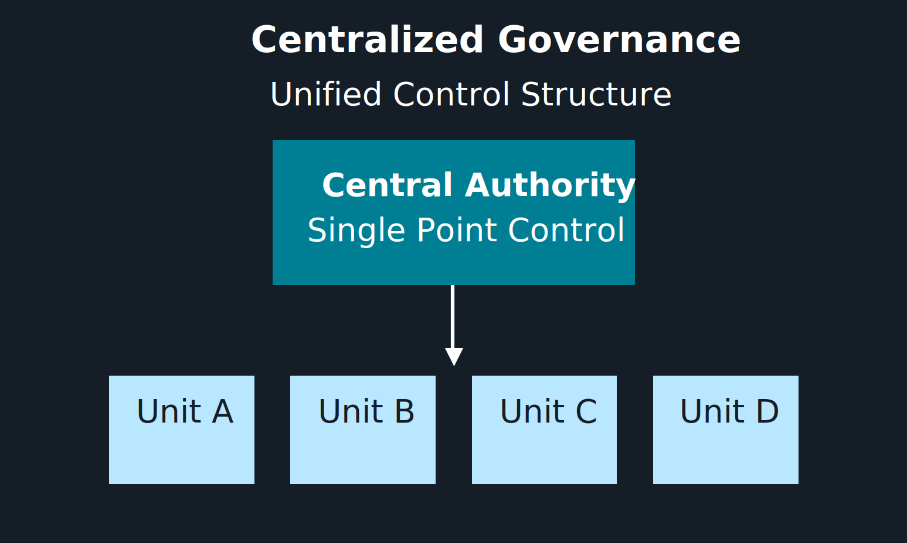  
  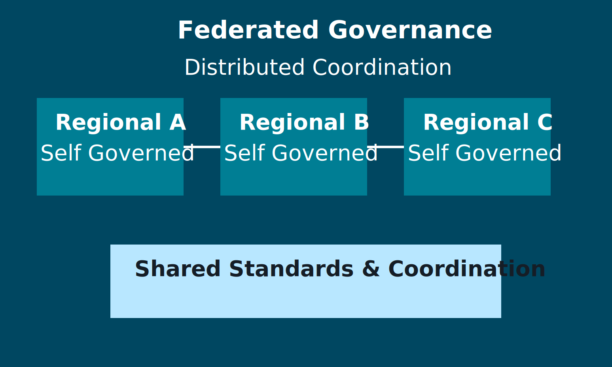  
  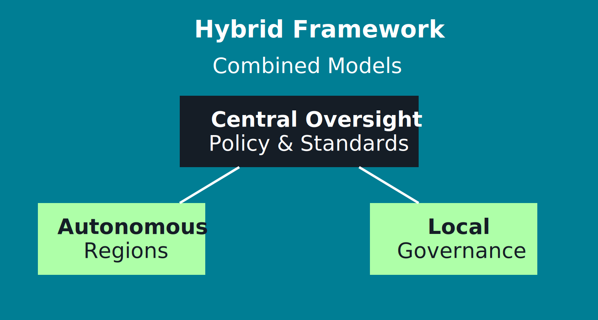  
  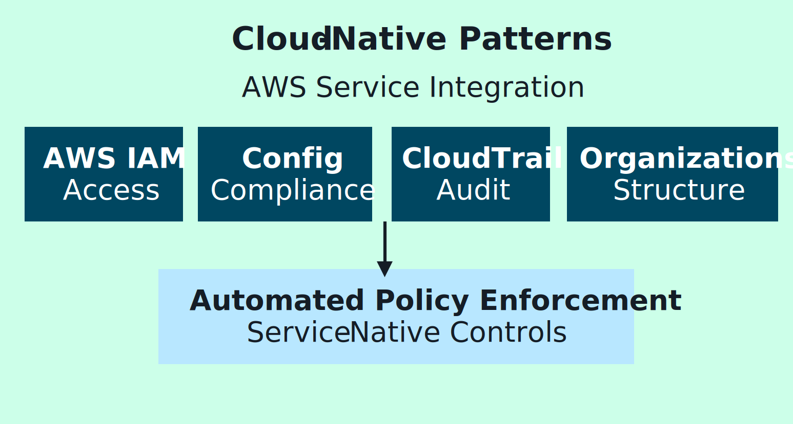

- **Security & enterprise controls**
  - Combine IAM, network isolation, KMS, and Bedrock Guardrails with prompt governance.

  _Diagram:_  
  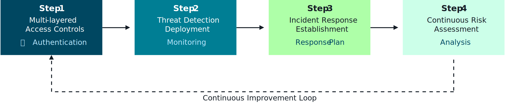

- **Compliance monitoring**
  - Feed prompt usage and Guardrail triggers into **CloudTrail and CloudWatch**.
  - Build dashboards and alerts for policy violations, drift, or regressions.

  _Diagrams:_  
  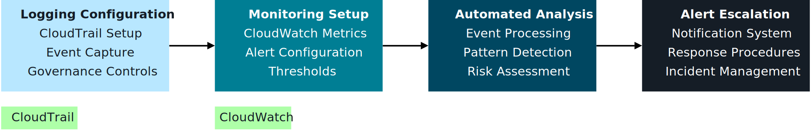  
  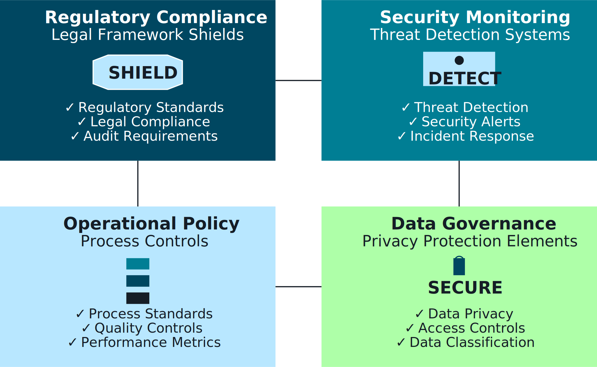

- **Performance & cost governance**
  - Monitor latency, error rates, and token usage.
  - Use routing and configuration to steer traffic to **cost‑effective** models and prompts.

  _Diagram:_  
  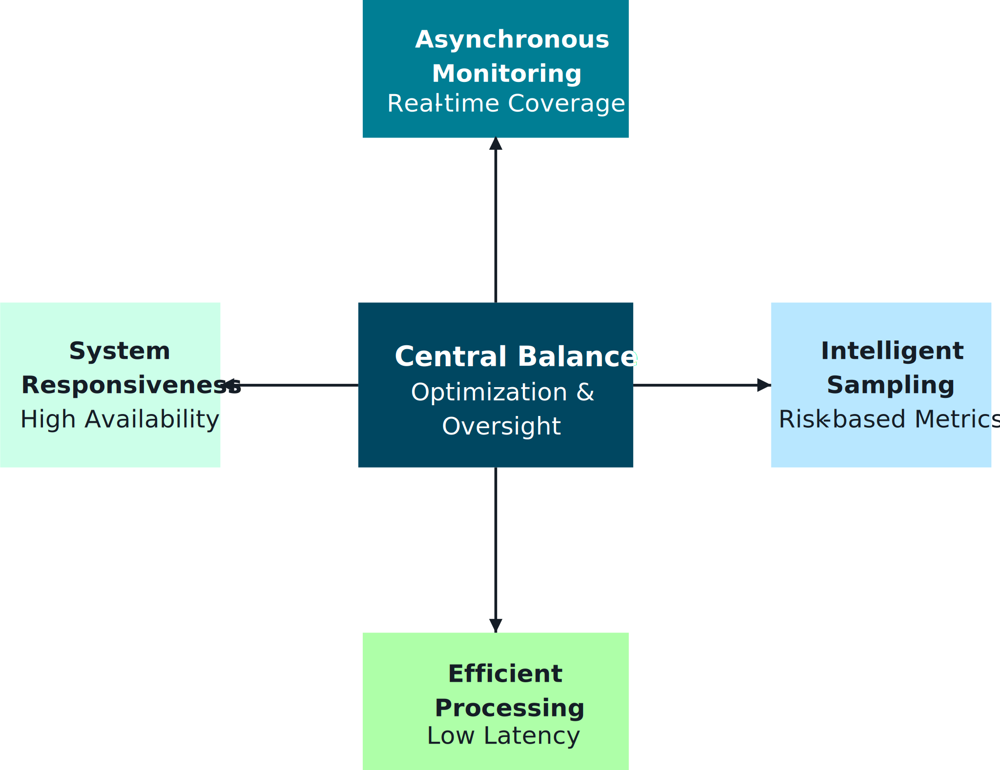

Link this section with **OWASP Top 10 / CWE Top 25**: prompts and Guardrails are part of your **defense-in-depth** story.

---

## 6. Flashcards – Prompt management & governance 📚

- **Q1. Why treat prompts like code?**  
  **A1.** To gain versioning, reviews, testing, and rollback capabilities, making FM behavior predictable and auditable.

- **Q2. What are the main stages of a prompt’s lifecycle?**  
  **A2.** Authoring, storage/version control, validation/testing, deployment/runtime config, monitoring, and iterative improvement.

- **Q3. How does prompt management support governance and oversight?**  
  **A3.** By linking business policies to specific prompts, tracking changes, enforcing approvals, and monitoring behavior via logs and evaluations.

- **Q4. What’s the role of AWS services (CloudTrail/CloudWatch/AppConfig) in prompt governance?**  
  **A4.** AppConfig manages runtime prompt configs, while CloudTrail and CloudWatch provide logging, metrics, and alerts for auditing and compliance.

- **Q5. How do governance architecture patterns (centralized vs. federated) affect prompt management?**  
  **A5.** They determine who owns prompts, how standards are enforced, and how much autonomy teams have while still meeting global security and compliance requirements.

