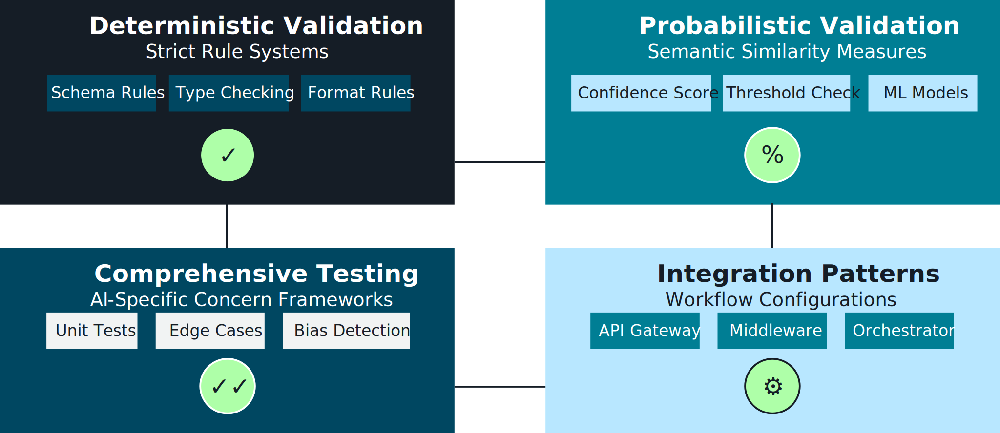
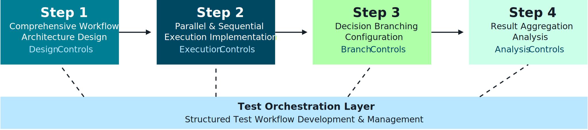
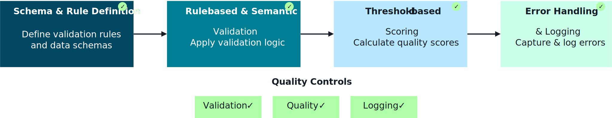
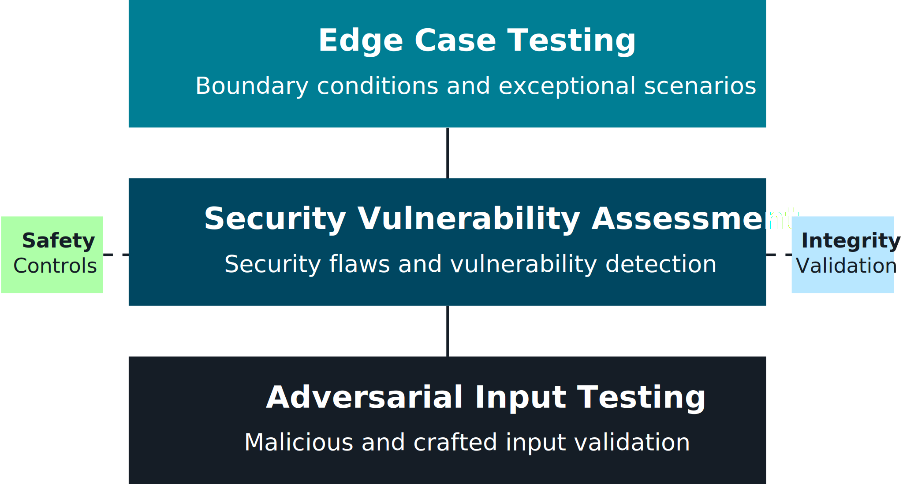
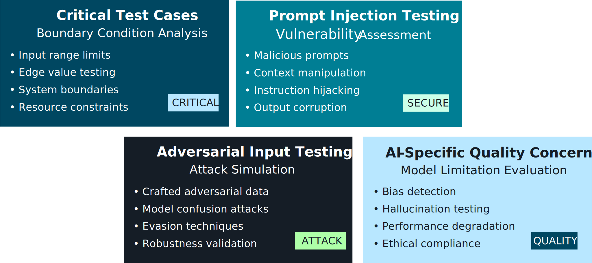
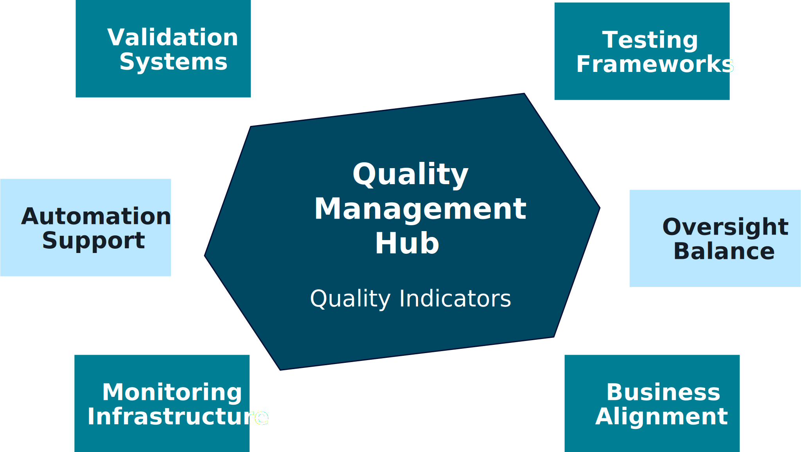
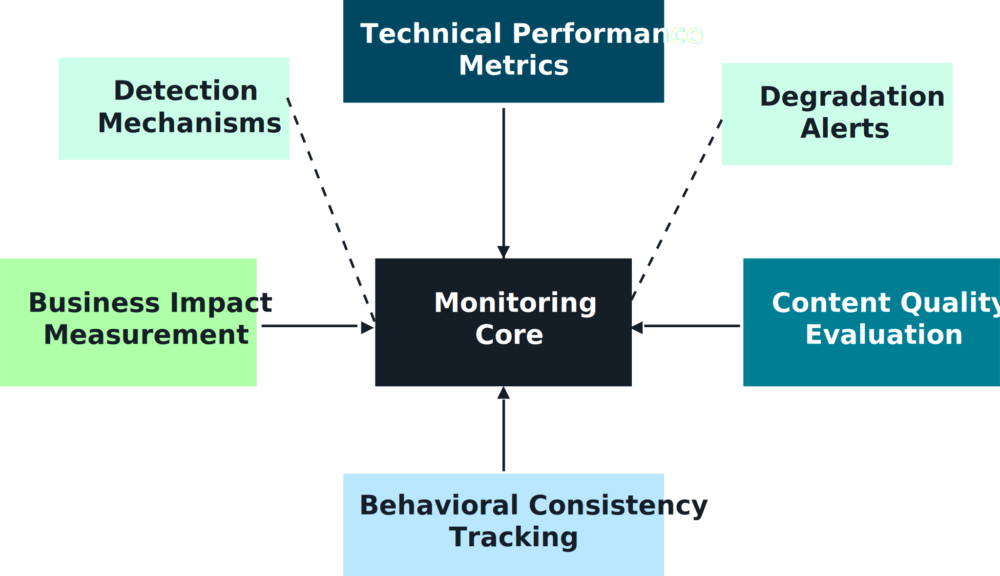
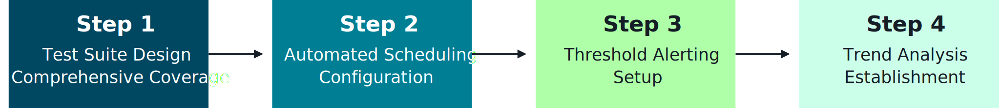
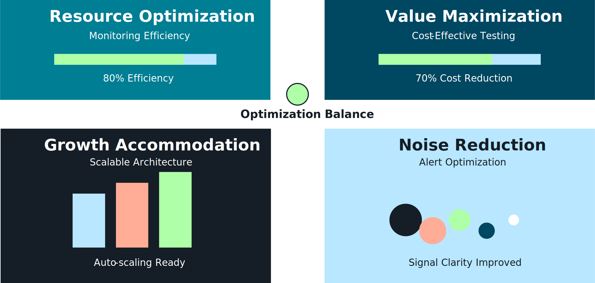

## Quality Assurance of Foundation Models 🧪📊

Quality assurance (QA) for foundation models means **continuously checking that models behave as expected** – accurate, safe, cost-effective, and stable over time – across prompts, versions, and workloads.

This section focuses on **validation, testing, and monitoring patterns** you’re likely to see on the exam.

---

## 1. Validation approaches & strategies ✅

Before shipping a new model, prompt, or guardrail config, you need a **structured validation strategy**:

- **Functional validation**
  - Does the system produce correct, useful answers for core use cases?
  - Use golden test sets, SME review, and automatic metrics.

- **Safety & security validation**
  - Test for **prompt injection**, data leakage, and policy violations (OWASP / CWE aligned).
  - Include adversarial prompts and red‑teaming.

- **Performance validation**
  - Latency, throughput, error rates, and cost per request.

_Diagram:_  

---

## 2. Test orchestration & specialized testing 🔁

### 2.1 Test orchestration process

Build an automated **test orchestration pipeline**:
- Triggered on **code, prompt, or config changes**.
- Runs multiple test suites (functional, safety, regression).
- Stores results for auditing and comparisons.

_Diagram:_  

### 2.2 Lambda-based validation

Use **AWS Lambda** to:
- Run validation jobs in parallel across many prompts/models.
- Integrate with CI/CD (e.g., CodePipeline, GitHub Actions).
- Push results to S3, DynamoDB, or CloudWatch for analysis.

_Diagram:_  

### 2.3 Specialized and edge-case testing

- **Specialized testing considerations**
  - Domain-specific datasets (medical, finance, legal).
  - Localization, accessibility, and bias/fairness checks.

  _Diagram:_  
  

- **Edge-case & security testing**
  - Stress unusual inputs, long prompts, malformed JSON, and injection attempts.
  - Validate guardrail and error‑handling behavior.

  _Diagram:_  
  

---

## 3. Integrated QA system architecture 🧩

Quality assurance is **end-to-end**, not just a single script:

- **Integrated QA architecture**
  - Connects:
    - Data sources (test datasets, logs, production samples).
    - Evaluation services (Bedrock evaluation, custom evaluators).
    - Storage and dashboards.
    - Notification and ticketing systems.

  _Diagram:_  
  

This architecture ensures that changes in prompts, models, or data **flow through the same QA pipeline**.

---

## 4. Continuous monitoring & regression detection 📈

After deployment, you must **continuously monitor** model quality:

- **Foundation model performance monitoring**
  - Track latency, error rates, token usage, and quality indicators.
  - Use sampled requests + human review for qualitative checks.

  _Diagram:_  
  

- **CloudWatch-based monitoring**
  - Emit custom metrics and structured logs from your apps and Lambdas.
  - Build CloudWatch dashboards and alarms for anomalies.

  _Diagram:_  
  

- **Regression testing in production**
  - Re-run test suites on **new model versions or prompt updates**.
  - Compare results across versions to detect regressions before full rollout.

  _Diagram:_  
  

---

## 5. Performance optimization & cost management 💰⚙️

QA also covers **cost and performance**:

- Monitor:
  - Token consumption and API charges.
  - Latency per route/model.
  - Cache hit rates and fallback usage.

- Use results to:
  - Tune prompts for shorter, more efficient outputs.
  - Route traffic to cheaper models where acceptable.
  - Adjust sampling, max tokens, and streaming vs. non‑streaming.

_Diagram:_  

Connect this with **model routing, circuit breakers, and graceful degradation** from earlier sections.

---

## 6. Flashcards – FM Quality Assurance 📚

- **Q1. What are the three main dimensions of FM validation?**  
  **A1.** Functional quality, safety/security, and performance (latency, reliability, cost).

- **Q2. Why orchestrate tests instead of running ad-hoc scripts?**  
  **A2.** Orchestration makes tests repeatable, automatable, auditable, and easy to integrate with CI/CD and change management.

- **Q3. How does continuous monitoring complement pre-deployment validation?**  
  **A3.** Monitoring detects drift, regressions, and new failure modes that only appear under real production traffic and data.

- **Q4. What AWS services commonly appear in FM QA pipelines?**  
  **A4.** Lambda (test execution), S3/DynamoDB (results), CloudWatch (metrics/logs/alarms), and Bedrock evaluation tools.

- **Q5. How is cost management part of quality assurance?**  
  **A5.** Ensuring a solution is sustainable requires tracking and optimizing cost/latency trade-offs while maintaining acceptable quality and safety.

