## Prompt Engineering for Enterprise FM Applications 🧩🏢

Enterprise prompt engineering is about designing **reliable, controllable patterns** that work across teams, regions, and workloads – not one‑off clever prompts.

This chapter ties together **structured inputs, output formats, reasoning patterns, and feedback loops** for large-scale, production FM applications.

---

## 1. Structured input components 🧱

Production prompts are **structured messages**, not free‑form text. The structure is what makes behavior:
- **Repeatable** – same inputs → similar outputs.
- **Auditable** – you can show exactly what the model saw.
- **Configurable** – you can change behavior via config, not code.

- **Role assignment**
  - Clearly specify *who* the model is (e.g., “You are a financial compliance assistant…”).
  - Aligns with your **instruction framework** and governance rules.
  - Enterprise pattern: define a **small set of standard roles** (e.g., “SupportAgent”, “RiskAnalyst”) and reuse them across teams.

  _Diagram:_  
  

- **Context framing**
  - Frame what information is relevant (docs, policies, user profile, region).
  - Make source boundaries explicit: “Use only the context below…”
  - Enterprise pattern: prepend a short **context disclaimer**, e.g. “If the answer is not in the context, say you don’t know.”

  _Diagram:_  
  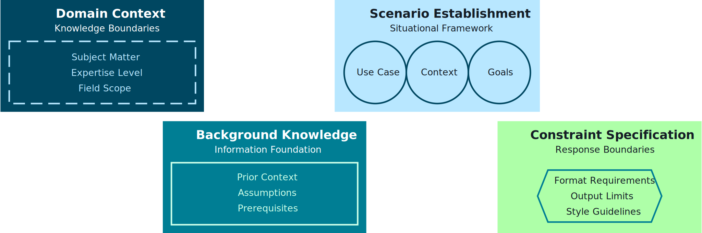

- **Multi-part structure**
  - Break prompts into labeled sections:
    - `INSTRUCTIONS`, `CONTEXT`, `TASK`, `OUTPUT_FORMAT`, `CONSTRAINTS`.
  - Makes prompts readable, testable, and easier to standardize.
  - This also makes it easy to **swap parts** (e.g., same task but different output format or constraints).

  _Diagram:_  
  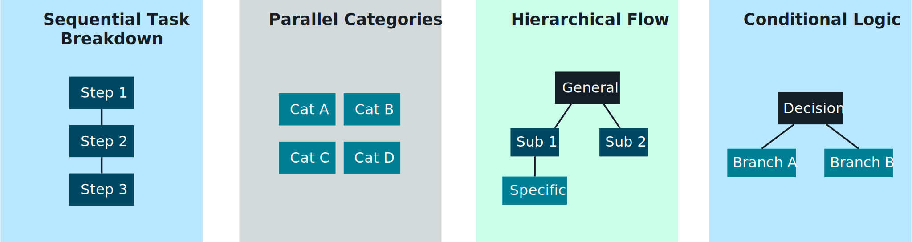

- **Sequential task breakdown**
  - Decompose complex workflows into ordered steps or sub‑tasks.
  - Example: “Step 1: extract entities → Step 2: classify risk → Step 3: summarize for a human reviewer.”

  _Diagram:_  
  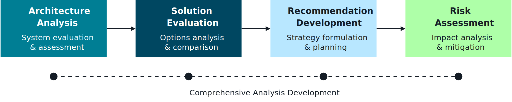

- **Systematic organization**
  - Use templates and configuration files to keep structure consistent across apps.
  - Store templates in **Git or a registry** and reference them by ID/version from your code.

  _Diagram:_  
  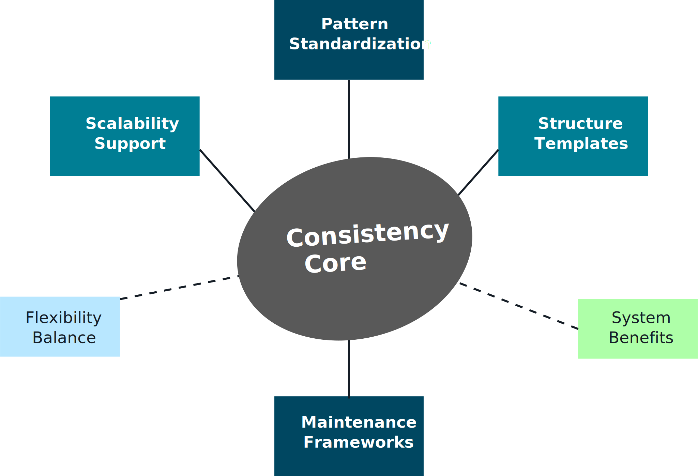

**Exam tip:** be ready to explain how structured inputs improve **input quality, safety (less injection), and governance** compared to ad‑hoc prompts.

---

## 2. Output format specifications 📤📑

Enterprises need outputs that are **machine-checkable and easy to integrate** – otherwise downstream systems break.

- **Output format fundamentals**
  - Prefer **JSON** or strongly structured markdown for downstream systems.
  - Define required and optional fields, types, and allowed values.
  - Always include a small **example** in your template so behavior is unambiguous:

```json
{
  "answer": "…",
  "citations": ["doc-123#section-4"],
  "riskFlags": ["MISSING_CONTEXT"]
}
```

  _Diagram:_  
  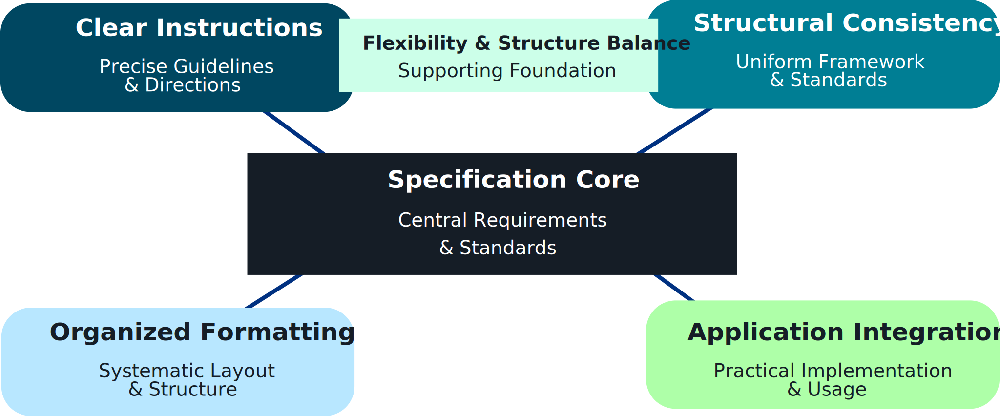

- **Format standards**
  - Create reusable contracts such as:
    - `Answer`, `citations[]`, `riskFlags[]`.
    - `classificationLabel`, `confidence`, `rationale`.
  - Reuse the same formats across multiple teams so dashboards and QA systems can compare results.

  _Diagram:_  
  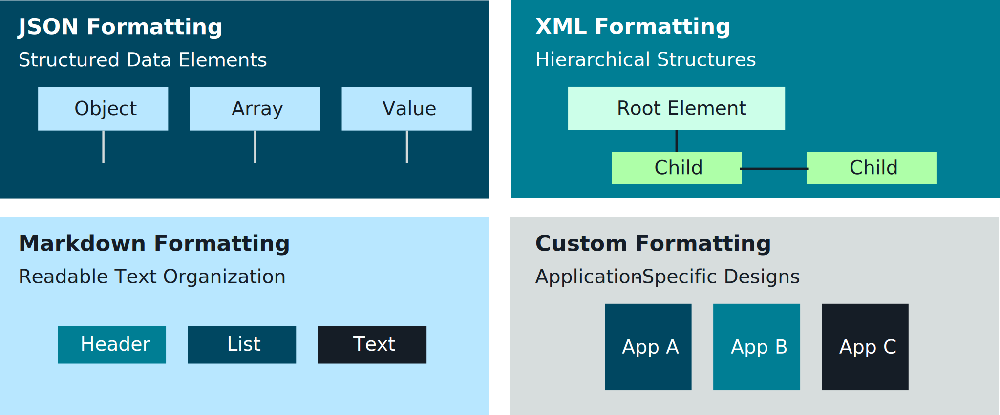

- **Constraint implementation**
  - Express constraints clearly (e.g., “Respond with valid JSON only. Do not add commentary.”).
  - Combine with **validators** and **schema checks** at the application layer.
  - On failure, route to a **retry with stricter instructions** or fallback handler.

  _Diagram:_  
  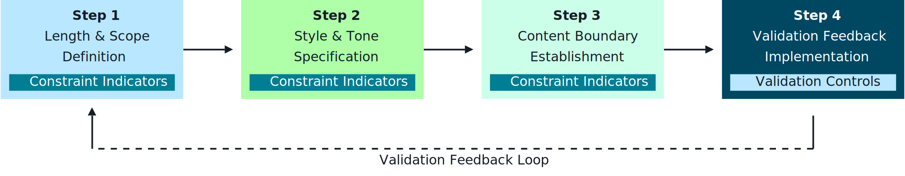

- **Integration into application systems**
  - Map FM outputs into workflows: tickets, knowledge bases, documents, APIs.
  - Example flows:
    - Classification output → routed to the correct support queue.
    - Summaries → stored in DynamoDB and surfaced in a UI.

  _Diagram:_  
  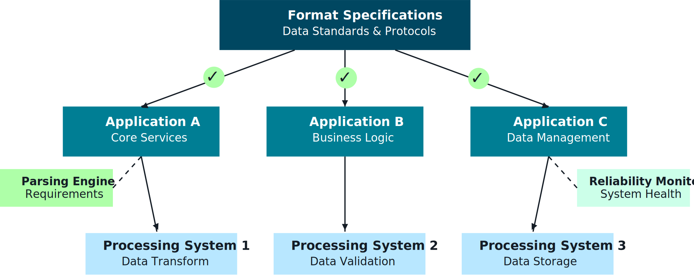

Connect this with **Standardized Function Calling** and **API patterns for RAG** sections elsewhere in the repo – those sections show how these contracts travel over APIs.

---

## 3. Chain-of-thought and structured reasoning 🧠🪜

For complex enterprise tasks, you often need **transparent, stepwise reasoning**, not just final answers.

- **Chain-of-thought process architecture**
  - Split responses into:
    - Reasoning steps (internal or hidden).
    - Final answer (short, user-facing).
  - Pattern: `reasoning` can be logged for audits while only `finalAnswer` is shown to users.

  _Diagram:_  
  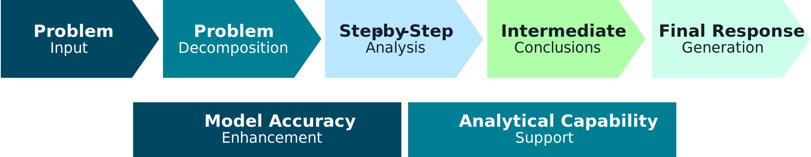

- **Problem decomposition strategies**
  - Ask the model to identify sub‑problems first, then solve them step by step.
  - Example: “First list the relevant policy clauses. Then, using those clauses only, decide if the claim is eligible.”

  _Diagram:_  
  

- **Complex reasoning patterns**
  - Use **checklists, trees, and tables** to reason over multi-factor decisions (e.g., risk scoring, claim adjudication).
  - This makes decisions easier to **review by humans** and to align with policies.

  _Diagram:_  
  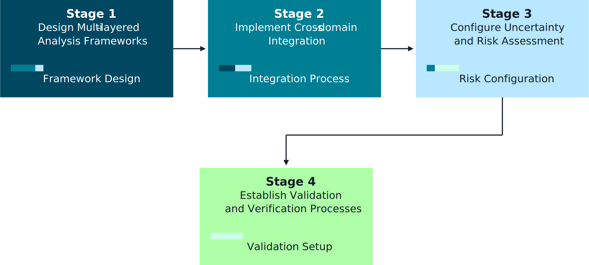

- **Branching logic**
  - Embed if/else‑style logic in prompts:
    - “If the request is about X, do Y; otherwise do Z.”
  - Useful for **multi-intent** flows (FAQ answer vs. escalation vs. transactional task).

  _Diagram:_  
  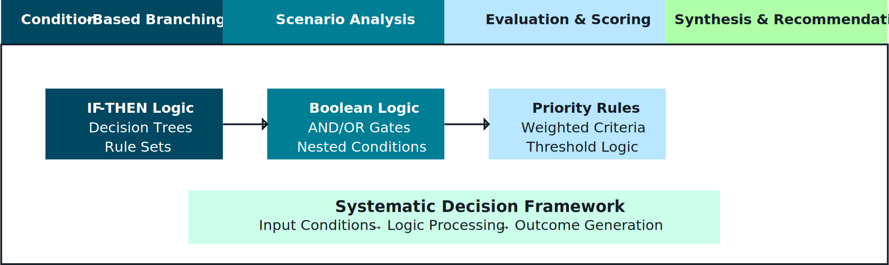

- **Benefits of structured reasoning**
  - More **stable outputs**, easier **debugging**, better **governance**.
  - Supports **explainability requirements** in regulated industries.

  _Diagrams (benefits series):_  
    
    
    
  

For safety‑sensitive domains, consider **hiding raw chain-of-thought** from end users while still using it internally for QA and audits.

---

## 4. Iterative feedback loops & progressive refinement 🔁

Enterprise systems rarely rely on a **single prompt turn** – they use **loops** to gradually improve quality.

- **Progressive improvement cycles**
  - Generate → evaluate → refine → finalize.
  - Can be human‑in‑the‑loop, model‑in‑the‑loop, or both.
  - Example: user draft → FM rewrite → human approval → FM final polish.

  _Diagram:_  
  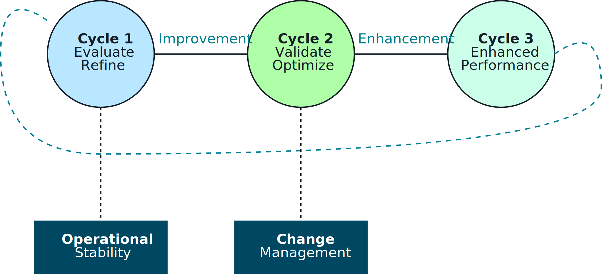

- **Response evaluation frameworks**
  - Standardize evaluation criteria (correctness, completeness, safety, tone).
  - Use Bedrock eval, custom LLM judges, or SME review.
  - Important: store **scores + reasons** so you can debug regressions later.

  _Diagram:_  
  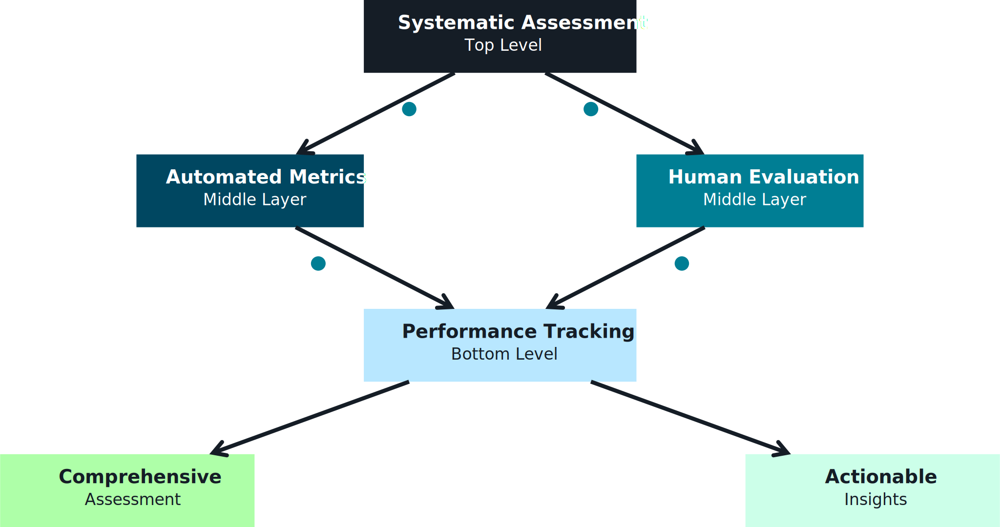

- **Quality assessment metrics**
  - Define measurable KPIs:
    - Task success rate.
    - Policy violation rate / Guardrail triggers.
    - User satisfaction or NPS.
  - Different stakeholders may care about different metrics (Ops: latency; Risk: safety; Product: satisfaction).

  _Diagram:_  
  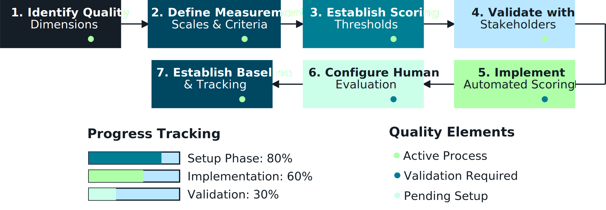

- **Systematic refinement**
  - Feed evaluation signals back into:
    - Prompt templates.
    - Guardrail policies.
    - Model selection and routing strategies.
  - Build a habit of **A/B testing** prompt variants before rolling them out broadly.

  _Diagram:_  
  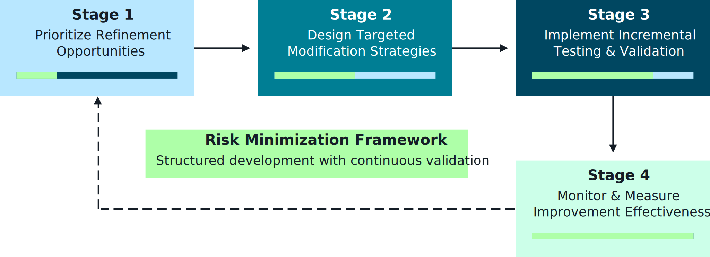

- **Error categorization**
  - Classify errors (hallucination, formatting, safety, latency, integration).
  - Helps prioritize fixes across model, prompt, data, or infra layers.
  - On the exam, connect this to **root-cause analysis**: not every problem is solved by “change the model.”

  _Diagram:_  
  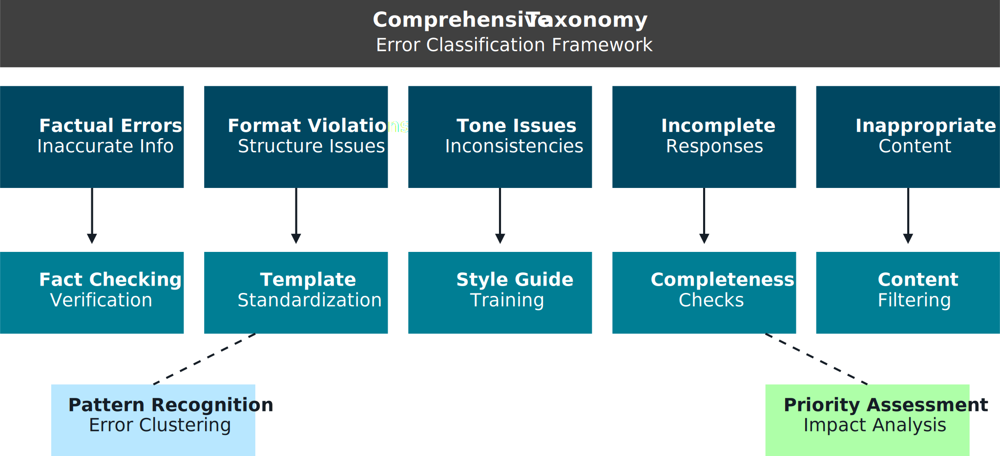

Link this to the **Quality Assurance of FMs** file: evaluation + refinement is a continuous loop, not a one‑time task.

---

## 5. Flashcards – Enterprise prompt engineering 📚

- **Q1. What are the core building blocks of an enterprise prompt?**  
  **A1.** Role assignment, context framing, multi-part structure, explicit task description, output format, and constraints.

- **Q2. Why are structured output formats critical in enterprise applications?**  
  **A2.** They enable reliable parsing, validation, integration with downstream systems, and easier governance and monitoring.

- **Q3. How does chain-of-thought prompting help in enterprise scenarios?**  
  **A3.** It improves reasoning quality, makes decisions more explainable, and simplifies debugging and audits (even if the reasoning is not shown to end users).

- **Q4. What is the purpose of iterative feedback loops in FM applications?**  
  **A4.** To continuously improve prompts, guardrails, and model choices based on measured quality, safety, and cost metrics.

- **Q5. How does prompt engineering tie into governance and QA?**  
  **A5.** Well‑designed prompts make behavior consistent and testable, while governance and QA frameworks ensure those prompts remain safe, compliant, and high‑quality over time.

- **Q6. Why do enterprises prefer multi-part prompt structures over single long instructions?**  
  **A6.** They separate concerns (instructions vs. context vs. output) making prompts easier to understand, reuse, test, and update without breaking other parts.

- **Q7. When should raw chain-of-thought be hidden from end users?**  
  **A7.** In safety‑sensitive or regulated domains where exposing intermediate reasoning could leak sensitive data or confuse users, while still keeping reasoning for internal QA and audit.

- **Q8. How do A/B tests fit into prompt engineering?**  
  **A8.** They allow you to compare prompt variants with real traffic and metrics, picking the best-performing version while controlling risk.


