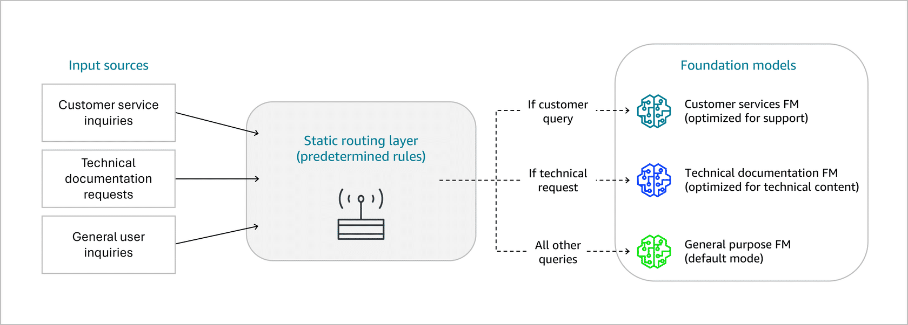

## Static Model Routing 🧭


Static model routing = **pre-defined rules in code** that decide which foundation model handles which task or input type.
Decisions are made ahead of time, not at runtime via content analysis.

Good for **well-defined, stable use cases** where tasks and input types are clear.



---

## 1. Concept & goal 🎯

- Choose models based on **known task types** (e.g., FAQ, tech support, creative writing).
- Keep routing logic **simple and predictable** (no content inspection or dynamic routing).
- Optimize specific workflows by assigning the **best model for each category**.

---

## 2. Static model routing fundamentals ⚙️

### How it works
You define fixed mappings between:

- **Input characteristics / task type → Specific model endpoint**

Examples:
- Customer service inquiries → general-purpose LLM
- Technical documentation → specialized technical LLM
- FAQ vs. complex support queries → different models

### Key characteristics
- Predetermined model assignments by task/category.
- Fixed routing rules that don’t change at runtime.
- Simple conditional logic (if/else, switch, mapping).
- Consistent performance for similar input types.

---

## 3. Advantages vs. disadvantages ⚖️

### Advantages
- Simple to implement and reason about.
- Predictable behavior & performance.
- Suitable for stable workloads and clear task boundaries.
- Easy to optimize specific tasks with specific models.

### Disadvantages
- Limited flexibility – changing routing requires code changes (or config edits).
- Suboptimal for nuanced inputs – can’t adapt to subtle differences.
- Manual maintenance when:
  - New models are added.
  - Business needs change.
- No automatic learning/optimization of routing over time.

---

## 4. Common use cases 📌

- **Well-defined input types**
  - e.g., documents reliably classified as invoices, contracts, reports.

- **Task-specific model optimization**
  - Financial analysis → finance-tuned model.
  - Creative writing → generative/creative model.

- **FAQ chatbot**
  - Simple FAQ → cheap/lightweight model.
  - Complex tech support → more capable, expensive model.

- **Content type segregation**
  - Image requests → vision model.
  - Text requests → language model.

---

## 5. Implementation patterns 🧩

### 5.1 Code-based static routing (example pattern)
Use a `StaticModelRouter` class with a mapping from request types → model IDs, e.g.:

```python
self.model_mappings = {
    "faq": "anthropic.claude-3-haiku-20240307-v1:0",
    "technical_support": "anthropic.claude-3-sonnet-20240229-v1:0",
    "creative_writing": "anthropic.claude-3-opus-20240229-v1:0",
    "data_analysis": "amazon.titan-text-express-v1"
}
```

Routing flow:
- `route_request(request_type, input_text)`:
  - Looks up model ID from the mapping.
  - Calls `invoke_model()` with that ID.
- `invoke_model()`:
  - Builds the request body.
  - Uses `bedrock-runtime.invoke_model()`.
  - Returns the parsed response.

This is static routing because the model is chosen **purely based on `request_type`**, not on runtime content analysis.

### 5.2 Configuration-based static routing
Same idea, but mappings are externalized:

- Config files (JSON/YAML).
- Environment variables.
- Parameter Store / AppConfig.

Routing is still **static (not content-aware)**, but easier to adjust without changing code.

---

## 6. Best practices for static model routing ✅

### Code maintainability
- Put routing logic in clear, testable functions/classes.
- Use meaningful names and documentation.
- Keep routing logic **centralized** to avoid duplication.

### Performance
- Reuse or cache model clients/connections.
- Use connection pooling where applicable.
- Use async/parallel calls if handling many requests concurrently.

### Error handling
- Implement fallbacks (e.g., default model if mapping missing).
- Log routing decisions and errors for debugging.
- Provide clear error messages when request types are unknown.

### Configuration
- Externalize routing rules (config files, env vars, parameter store/AppConfig).
- Allow updates without full redeploy (even though routing remains static).
- Version and validate routing configs.


