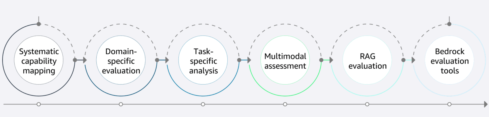

## Foundation Model Evaluation Frameworks 🎯

This guide summarizes how to systematically evaluate and select foundation models (FMs) for real-world applications.

---

## 1. Foundation model landscape 🌍

### 1.1 Types of foundation models
- **LLMs (Language models)**: Text understanding and generation.
- **Multimodal models**: Work across text + images + other modalities.
- **Specialized models**: Tuned for narrow domains (e.g., code, medical, scientific).

### 1.2 Key differentiators
When choosing a model, compare:

- **Model size / parameter count**
  - Larger → usually better capability, higher cost/latency.

- **Training data & methodology**
  - Domains covered, time window, filtering, safety tuning.
  - Drives knowledge, bias, and behavior.

- **Architecture design**
  - Decoder-only vs encoder-decoder, mixture-of-experts, etc.
  - Affects efficiency, latency, and quality.

- **Licensing & availability**
  - Open vs proprietary, on-prem vs managed service.
  - Usage restrictions, data handling guarantees, cost model.

---

## 2. Performance benchmarking fundamentals 📊

### 2.1 Standard benchmarks
Use industry benchmarks to compare models on common tasks (directional only):

- **MMLU** – broad general/domain knowledge.
- **HumanEval** – code generation.
- **HELM** – multi-dimension eval (accuracy, fairness, toxicity, etc.).

> ⚠️ Benchmark scores ≠ guaranteed real-world performance; always validate on your own data.

### 2.2 Customized benchmarks
Build custom evals that match your use case:

- Use **realistic prompts and data** from your domain.
- Define **success metrics**:
  - Quality, latency, domain accuracy, safety thresholds.
- Align metrics with **business objectives**, not just raw scores.

### 2.3 Interpreting results
Higher score doesn’t always mean “best for you.” Consider:

- How the benchmark was built (data, metrics, biases).
- Multiple benchmarks together → more complete picture.
- Always interpret in **your** context (domain, constraints, risks).

---

## 3. Capability assessment framework (multi-dimension evaluation) 🧭

**Goal:** Evaluate AI systems holistically, not just on a single test.

### 3.1 Systematic capability mapping
- **Capability matrix:**
  - Grid of capabilities (e.g., reasoning, summarization, coding) vs performance levels.
  - Supports gap analysis and model comparison.
- **Competency framework integration:**
  - Map capabilities to business processes and roles.
- **Functional taxonomy:**
  - Standard vocabulary and hierarchy for capabilities across the org.

Examples of benchmarks/leaderboards: **HELM, BIG-Bench, BabyAI, GLUE/SuperGLUE**.

### 3.2 Domain-specific evaluation
Focus: How well the model works in a **specific industry/knowledge domain**.

- **Industry benchmarks:**
  - Compare models vs domain standards (e.g., medical, finance).
- **Domain expert review:**
  - SMEs check subtle errors and reasoning quality.
- **Use case alignment:**
  - Evaluate on real workflows and scenarios, not toy prompts.

Example domain benchmarks: **MMLU, MedPaLM (medical), FinanceBench, Bedrock industry tracks**.

### 3.3 Task-specific analysis
Focus: How well the model does a **specific task type**, regardless of domain.

- **Precision/recall:**
  - Balance false positives vs false negatives.
- **Response quality:**
  - Coherence, relevance, helpfulness, alignment with intent.
- **Efficiency metrics:**
  - Latency, throughput, compute usage, scalability.

Example task benchmarks: **MT-Bench (chat), HumanEval+/MBPP+ (coding), GSM8K & MATH (math reasoning), BIG-Bench Hard (complex reasoning)**.

### 3.4 Multimodal assessment
Focus: Handling and integrating multiple modalities (text, image, audio, video).

- **Cross-modal coherence:**
  - Does text match image/audio? Is information consistent?
- **Modal-specific performance:**
  - How good is each modality individually?
- **Integration assessment:**
  - How well does the model reason using combined modalities?

Example multimodal benchmarks: **MMMLU, LMSys Chatbot Arena multimodal tracks, MMMU, MME**.

### 3.5 RAG evaluation (Retrieval-Augmented Generation)
Focus: How well the system retrieves and uses external knowledge.

- **Retrieval accuracy:**
  - Precision, recall, relevance, diversity of retrieved docs.
- **Knowledge integration:**
  - Does the model correctly use and reconcile retrieved info?
- **Source attribution:**
  - Are citations accurate? Is it clear what’s retrieved vs parametric?

Example RAG benchmarks: **RAGAS, Bedrock RAG capabilities leaderboard, KILT, RULER**.

### 3.6 Bedrock evaluation tools
Amazon Bedrock provides built-in evaluation tooling:

- **Model Evaluation Service:**
  - Standard + custom metrics; compare model versions and providers.
- **Automated Testing Framework:**
  - Continuous evaluation with test suites integrated into dev/CI.
- **Performance Dashboard:**
  - Real-time metrics, trends, drill-downs by capability.
- Additional safety benchmark: **TRUSTLLM** – safety, reliability, risk assessment.

---

## 4. Identifying and managing limitations ⚠️

Foundation models have inherent limitations:
- Hallucinations and fabricated facts.
- Outdated knowledge (training cutoffs).
- Bias and fairness issues.
- Security/privacy risks.
- Weak math/logical reasoning in some cases.

Mitigation requires:
- Identify common failure modes (for **your** use case).
- Evaluate systematically (benchmarks, red-teaming, SME review).
- Implement mitigation strategies, such as:
  - Output validation (rules, secondary checks, consistency checks).
  - Human review for high-impact / regulated scenarios.
  - Fallback mechanisms (simpler rules, deterministic systems, or different models when confidence is low).

---

## 5. Business application alignment 💼

**Goal:** Ensure model choice and design support real business goals and ROI.

### 5.1 Requirements mapping
Start from **use case and business requirements**:

- Accuracy thresholds.
- Latency & throughput limits.
- Integration complexity (APIs, data, security, governance).

Map these to model capabilities to check fit and gaps.

### 5.2 Cost analysis (TCO + ROI)
Consider **total cost of ownership**:

- Model/API usage.
- Infra (compute, storage, networking).
- Development and integration.
- Ongoing monitoring, evaluation, and maintenance.

Compare against **expected business value** to justify investment.

### 5.3 Selection criteria
Build a **weighted scoring framework** that balances:

- Technical performance (benchmarks, latency, robustness).
- Business fit (use case alignment, domain coverage).
- Cost and scalability.
- Risk & compliance (safety, governance, data residency).

Use it to objectively compare models and make **data-driven choices**.

---

## Flashcards 🧠📚

Use these as quick-recall prompts: **hide the answer, read the question, then check yourself.**

### 1. Foundation Model Landscape
- **Q1. What are the three main categories of foundation models?**  
  **A1.** LLMs (language models), Multimodal models, Specialized models (e.g., code, scientific).

- **Q2. What do LLMs primarily focus on?**  
  **A2.** Text understanding and text generation.

- **Q3. What do multimodal models handle?**  
  **A3.** Multiple data types (text, images, audio, sometimes video).

- **Q4. What are specialized models?**  
  **A4.** Models trained/tuned for specific domains or tasks (e.g., code generation, medical, scientific).

- **Q5. List four key differentiators for foundation models.**  
  **A5.** Model size/parameter count; Training data & methodology; Architecture design; Licensing & availability.

- **Q6. How does model size (parameter count) affect usage?**  
  **A6.** Larger models usually offer higher capability but with more compute, cost, and latency.

- **Q7. Why is training data and methodology important?**  
  **A7.** It determines what the model “knows,” its bias profile, and behavior on different tasks.

- **Q8. Why do licensing and availability matter?**  
  **A8.** They affect deployment options (cloud, on-prem, VPC), compliance, and total cost.

### 2. Performance Benchmarking Fundamentals
- **Q9. What is the main purpose of standard benchmarks for models?**  
  **A9.** To provide consistent, comparable metrics across different models.

- **Q10. Name three standard benchmarks and their focus.**  
  **A10.** MMLU (general/domain knowledge); HumanEval (code generation); HELM (holistic: accuracy, fairness, toxicity, etc.).

- **Q11. Why aren’t benchmark scores alone sufficient for model selection?**  
  **A11.** They may not reflect performance on your specific use cases, data, constraints, and domain.

- **Q12. What should custom benchmarks include?**  
  **A12.** Realistic tasks/prompts, real-world data samples, and success criteria aligned to business goals (quality, latency, domain accuracy, safety).

- **Q13. What are three key factors when interpreting benchmark results?**  
  **A13.** Evaluation methodology/metrics; Test data characteristics/biases; Comparison across multiple benchmarks plus your specific requirements.

### 3. Capability Assessment Framework (High-Level)
- **Q14. What is the purpose of a capability assessment framework?**  
  **A14.** To evaluate AI systems holistically, identify gaps, guide deployment decisions, and align capabilities with business needs.

#### 3.1 Systematic Capability Mapping
- **Q15. What is a capability matrix?**  
  **A15.** A grid mapping AI capabilities (e.g., summarization, coding, reasoning) against performance levels to enable gap analysis and comparison.

- **Q16. Goal of integrating AI with a competency framework?**  
  **A16.** Align AI capabilities with organizational roles and processes; set performance expectations across domains.

- **Q17. What is a functional taxonomy here?**  
  **A17.** A hierarchical structure and common vocabulary to categorize AI capabilities and track their evolution.

- **Q18. Name two benchmarks that help with capability mapping.**  
  **A18.** HELM; BIG-Bench / BIG-Bench Hard (also GLUE/SuperGLUE, BabyAI).

#### 3.2 Domain-Specific Evaluation
- **Q19. What is domain-specific evaluation?**  
  **A19.** Evaluating AI performance within a particular industry/knowledge domain (e.g., medical, finance).

- **Q20. Three approaches used in domain-specific evaluation?**  
  **A20.** Industry benchmarks; SME qualitative review; Testing on real use cases/workflows.

- **Q21. Name two domain-specific benchmarks and their domains.**  
  **A21.** MedPaLM (medical); FinanceBench (finance). (Also MMLU, Bedrock industry tracks.)

#### 3.3 Task-Specific Analysis
- **Q22. What is task-specific analysis?**  
  **A22.** Evaluation of how well AI performs a particular task type (e.g., coding, math, chat), independent of domain.

- **Q23. Three important metric types in task-specific analysis?**  
  **A23.** Precision/recall (or similar accuracy); Response quality; Efficiency (latency, throughput, resources).

- **Q24. Two task-specific benchmarks and focus?**  
  **A24.** MT-Bench (multi-turn conversational quality); HumanEval+/MBPP+ (code generation). (Also GSM8K/MATH, BIG-Bench Hard.)

#### 3.4 Multimodal Assessment
- **Q25. What is multimodal assessment?**  
  **A25.** Evaluation of how well AI systems handle and integrate multiple modalities (text, images, audio, video).

- **Q26. Three key aspects of multimodal assessment?**  
  **A26.** Cross-modal coherence; Modal-specific performance; Integration/cross-modal reasoning quality.

- **Q27. Name two multimodal benchmarks.**  
  **A27.** MMMU; LMSys Chatbot Arena multimodal tracks (also MMMLU, MME).

#### 3.5 RAG Evaluation (Retrieval-Augmented Generation)
- **Q28. What is the goal of RAG evaluation?**  
  **A28.** Measure how effectively a system retrieves external knowledge and integrates it into responses.

- **Q29. Three key elements in RAG evaluation?**  
  **A29.** Retrieval accuracy; Knowledge integration quality; Source attribution and provenance.

- **Q30. Name two RAG benchmarks.**  
  **A30.** RAGAS; KILT (also Bedrock RAG leaderboards, RULER).

#### 3.6 Bedrock Evaluation Tools
- **Q31. What does the Bedrock Model Evaluation Service provide?**  
  **A31.** Standard + custom metrics to compare model versions/providers.

- **Q32. Purpose of the Bedrock Automated Testing Framework?**  
  **A32.** Continuous, automated evaluation (CI/CD) to track behavior changes over time.

- **Q33. What does the Bedrock Performance Dashboard offer?**  
  **A33.** Real-time performance metrics, trend analysis, and capability drill-down.

- **Q34. What does the TRUSTLLM benchmark focus on?**  
  **A34.** Safety, reliability, and risk assessment aligned with AI governance.

### 4. Identifying and Evaluating Limitations
- **Q35. Three high-level steps to manage FM limitations?**  
  **A35.** Identify failure modes; Systematically evaluate; Implement targeted mitigations.

- **Q36. Three typical mitigation strategies?**  
  **A36.** Output validation; Human review for critical tasks; Fallback mechanisms (rules, alternate models, non-AI systems).

### 5. Business Application Alignment
#### 5.1 Requirements Mapping
- **Q37. Main goal of requirements mapping?**  
  **A37.** Connect business requirements (accuracy, latency, throughput, integration) to model capabilities and constraints.

- **Q38. Four important requirement dimensions?**  
  **A38.** Accuracy; Latency; Throughput/volume; Integration complexity (APIs, data, security/compliance).

#### 5.2 Cost Analysis
- **Q39. What is TCO for foundation models?**  
  **A39.** Combined cost of model/API usage, infra, development, monitoring, and maintenance.

- **Q40. How should TCO be used in decisions?**  
  **A40.** Compare TCO against expected business value/ROI to justify or reject implementations.

#### 5.3 Selection Criteria
- **Q41. Why use a weighted selection framework?**  
  **A41.** To objectively compare models across multiple factors and make transparent, data-driven decisions.

- **Q42. Four commonly weighted factors in selection?**  
  **A42.** Technical performance; Business fit; Cost & scalability; Risk, safety, and compliance.

